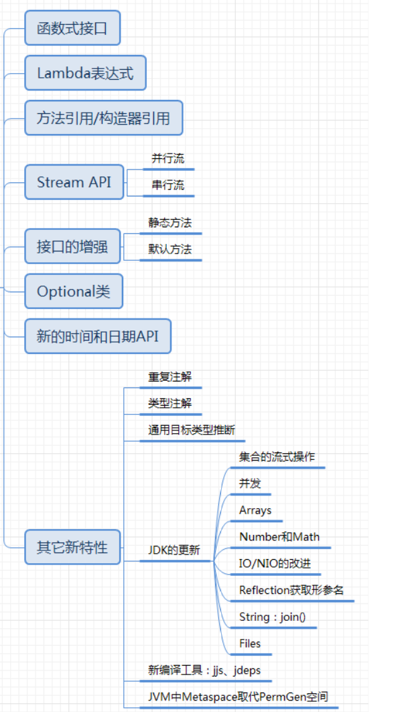
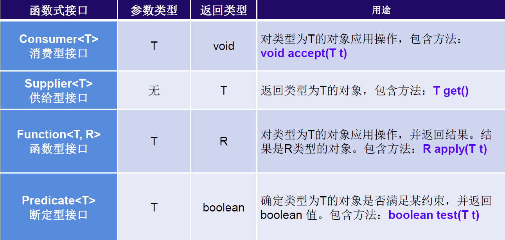
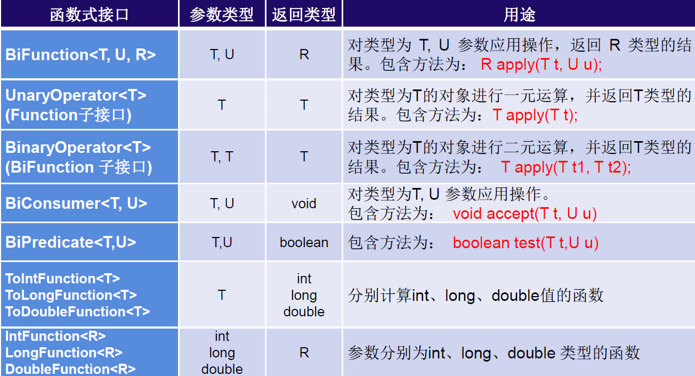
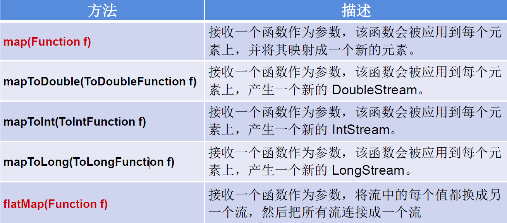
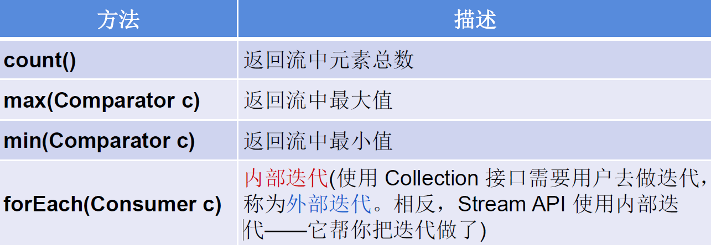
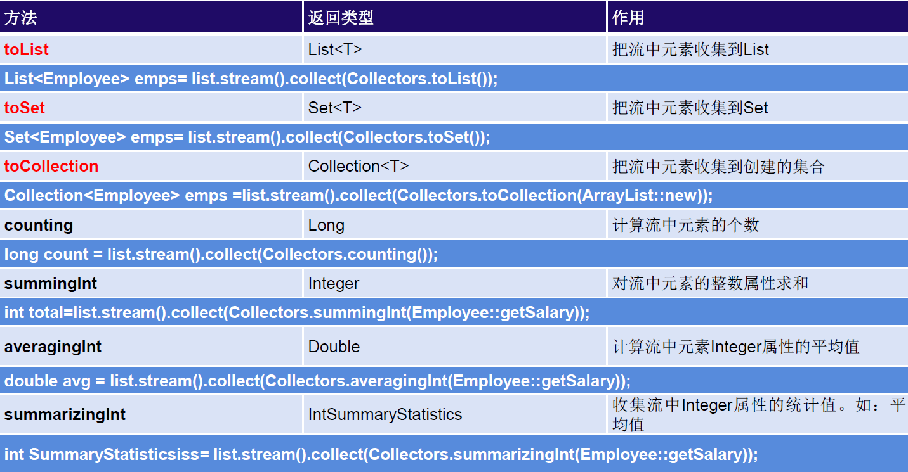
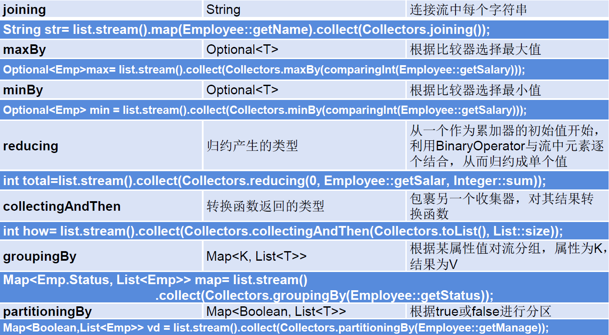

# Java 之 Java 8 新特性 


**Java 8 新特性汇总**





**Java 8 的改进**

- 速度更快
- 代码更少（增加了新的语法：Lambda 表达式）
- 引入强大的 Stream APl
- 便于并行
- 最大化减少空指针异常：Optional
- Nashorn 引擎，允许在 JVM 上运行 JS 应用
- 并行流就是把一个内容分成多个数据块，并用不同的线程分别处理每个数据块的流。相比较串行的流，并行的流可以很大程度上提高程序的执行效率。
- Java 8 中将并行进行了优化，我们可以很容易的对数据进行并行操作。Stream API 可以声明性地通过 parallel() 与 sequential() 在并行流与顺序流之间进行切换

## 一、Lambda 表达式

### 1. Lamdba 表达式概述

Lambda 是一个匿名函数，可以把 Lambda 表达式理解为是一段可以传递的代码（将代码像数据一样进行传递）。使用它可以写出更简洁、更灵活的代码。作为一种更紧凑的代码风格，使 Java 的语言表达能力得到了提升。

### 2. 使用 Lambda 表达式前后对比

** 示例一：** 调用 Runable 接口

```java
@Test
public void test1(){
    //未使用Lambda表达式的写法
    Runnable r1 = new Runnable() {
        @Override
        public void run() {
            System.out.println("hello Lambda!");
        }
    };
    r1.run();

    System.out.println("========================");
    //Lamdba表达式写法
    Runnable r2 = () -> System.out.println("hi Lambda!");
    r2.run();
}
```

** 示例二：** 使用 Comparator 接口

```java
@Test
public void test2(){
    //未使用Lambda表达式的写法
    Comparator<Integer> com1 = new Comparator<Integer>() {
        @Override
        public int compare(Integer o1, Integer o2) {
            return Integer.compare(o1,o2);
        }
    };

    int compare1 = com1.compare(12, 32);
    System.out.println(compare1);//-1
    System.out.println("===================");

    //Lambda表达式的写法
    Comparator<Integer> com2 = (o1,o2) -> Integer.compare(o1,o2);

    int compare2 = com2.compare(54, 21);
    System.out.println(compare2);//1
    System.out.println("===================");

    //方法引用
    Comparator<Integer> cpm3 = Integer::compareTo;
    int compare3 = cpm3.compare(12, 12);
    System.out.println(compare3);//0
}
```

### 3. 怎样使用 Lambda 表达式

#### 3.1 Lamdba 表达式基本语法

\1. 举例： `(o1,o2) -> Integer.compare(o1,o2);`

\2. 格式：

-  `->` ：lambda 操作符 或 箭头操作符
- `->` 左边：lambda 形参列表 （其实就是接口中的抽象方法的形参列表）
- `->` 右边：lambda 体 （其实就是重写的抽象方法的方法体）

#### 3.2 Lamdba 表达式使用（包含六种情况）

**3.2.1 语法格式一：无参，有返回值**

```java
Runnable r1 = () -> {System.out.println(“hello Lamdba!”)}
```

**3.2.2 语法格式二：Lamdba 需要一个参数，但没有返回值**

```java
Consumer<String> con = (String str) -> {System.out.println(str)}
```

**3.2.3 语法格式三：数据类型可省略，因为可由编译器推断得出，称为类型推断**

```java
Consumer<String> con = (str) -> {System.out.println(str)}
```

**3.2.4 语法格式四：Lamdba 若只需要一个参数时，小括号可以省略**

```java
Consumer<String> con = str -> {System.out.println(str)}
```

**3.2.5 语法格式五：Lamdba 需要两个以上的参数，多条执行语句，并且可以有返回值**

```java
Comparator<Integer>com = (o1,o1) -> {
	Syste.out.println("Lamdba表达式使用");
    return Integer.compare(o1,o2);
}
```

**3.2.6 语法格式六：当 Lamdba 体只有一条语句时，return 和大括号若有，都可以省略**

```java
Comparator<Integer>com = (o1,o1) ->	Integer.compare(o1,o2);
```

**代码示例：**

```java
public class LamdbaTest2 {
    //语法格式一：无参，无返回值
    @Test
    public void test1() {
        //未使用Lambda表达式
        Runnable r1 = new Runnable() {
            @Override
            public void run() {
                System.out.println("Hello Lamdba");
            }
        };
        r1.run();
        System.out.println("====================");
        //使用Lambda表达式
        Runnable r2 = () -> {
            System.out.println("Hi Lamdba");
        };
        r2.run();
    }

    //语法格式二：Lambda 需要一个参数，但是没有返回值。
    @Test
    public void test2() {
        //未使用Lambda表达式
        Consumer<String> con = new Consumer<String>() {
            @Override
            public void accept(String s) {
                System.out.println(s);
            }
        };
        con.accept("你好啊Lambda！");
        System.out.println("====================");
        //使用Lambda表达式
        Consumer<String> con1 = (String s) -> {
            System.out.println(s);
        };
        con1.accept("我是Lambda");

    }

    //语法格式三：数据类型可以省略，因为可由编译器推断得出，称为“类型推断”
    @Test
    public void test3() {
        //未使用Lambda表达式
        Consumer<String> con = new Consumer<String>() {
            @Override
            public void accept(String s) {
                System.out.println(s);
            }
        };
        con.accept("你好啊Lambda！");
        System.out.println("====================");
        //使用Lambda表达式
        Consumer<String> con1 = (s) -> {
            System.out.println(s);
        };
        con1.accept("我是Lambda");
    }

    @Test
    public void test(){
        ArrayList<String> list = new ArrayList<>();//类型推断，用左边推断右边
        int[] arr = {1,2,3,4};//类型推断，用左边推断右边
    }

    //语法格式四：Lambda 若只需要一个参数时，参数的小括号可以省略
    @Test
    public void test4() {
        //未使用Lambda表达式
        Consumer<String> con = new Consumer<String>() {
            @Override
            public void accept(String s) {
                System.out.println(s);
            }
        };
        con.accept("你好啊Lambda！");
        System.out.println("====================");
        //使用Lambda表达式
        Consumer<String> con1 = s -> {
            System.out.println(s);
        };
        con1.accept("我是Lambda");
    }

    //语法格式五：Lambda 需要两个或以上的参数，多条执行语句，并且可以有返回值
    @Test
    public void test5() {
        //未使用Lambda表达式
        Comparator<Integer> com1 = new Comparator<Integer>() {
            @Override
            public int compare(Integer o1, Integer o2) {
                System.out.println(o1);
                System.out.println(o2);
                return Integer.compare(o1, o2);
            }
        };
        System.out.println(com1.compare(23, 45));
        System.out.println("====================");
        //使用Lambda表达式
        Comparator<Integer> com2 = (o1, o2) -> {
            System.out.println(o1);
            System.out.println(o2);
            return o1.compareTo(o2);
        };
        System.out.println(com2.compare(23, 12));
    }

    //语法格式六：当 Lambda 体只有一条语句时，return 与大括号若有，都可以省略
    @Test
    public void test6() {
        //未使用Lambda表达式
        Comparator<Integer> com1 = new Comparator<Integer>() {
            @Override
            public int compare(Integer o1, Integer o2) {
                return Integer.compare(o1, o2);
            }
        };
        System.out.println(com1.compare(23, 45));
        System.out.println("====================");
        //使用Lambda表达式
        Comparator<Integer> com2 = (o1, o2) -> o1.compareTo(o2);

        System.out.println(com2.compare(23, 12));
    }
    @Test
    public void test7(){
        //未使用Lambda表达式
        Consumer<String> con1 = new Consumer<String>() {
            @Override
            public void accept(String s) {
                System.out.println(s);
            }
        };
        con1.accept("hi!");
        System.out.println("====================");
        //使用Lambda表达式
        Consumer<String> con2 = s -> System.out.println(s);
        con2.accept("hello");
    }

}
```

#### 3.3 Lambda 表达式使用总结

- `->` 左边：lambda 形参列表的参数类型可以省略 (类型推断)；如果 lambda 形参列表只有一个参数，其一对() 也可以省略
- `->` 右边：lambda 体应该使用一对 {} 包裹；如果 lambda 体只有一条执行语句（可能是 return 语句），省略这一对 {} 和 return 关键字

### 4. Lamdba 表达式总结

- Lambda 表达式的本质：作为函数式接口的实例
- 如果一个接口中，只声明了一个抽象方法，则此接口就称为函数式接口。我们可以在一个接口上使用 `@FunctionalInterface` 注解，这样做可以检查它是否是一个函数式接口。
- 因此以前用匿名实现类表示的现在都可以用 Lambda 表达式来写。

## 二、函数式接口

### 1. 函数式接口概述

- 只包含一个抽象方法的接口，称为函数式接口。
- 可以通过 Lambda 表达式来创建该接口的对象。（若 Lambda 表达式抛出一个受检异常（即：非运行时异常），那么该异常需要在目标接口的抽象方法上进行声明）。
- 可以在一个接口上使用 @FunctionalInterface 注解，这样做可以检查它是否是一个函数式接口。同时 javadoc 也会包含一条声明，说明这个接口是一个函数式接口。
- Lambda 表达式的本质：作为函数式接口的实例
- 在 `java.util.function` 包下定义了 Java 8 的丰富的函数式接口

**自定义函数式接口**

```java
@FunctionalInterface
public interface MyInterface {
    void method1();
}
```

### 3. Java 内置函数式接口

#### 3.1 四大核心函数式接口





**应用举例**

```java
public class LambdaTest3 {
    //    消费型接口 Consumer<T>     void accept(T t)
    @Test
    public void test1() {
        //未使用Lambda表达式
        Learn("java", new Consumer<String>() {
            @Override
            public void accept(String s) {
                System.out.println("学习什么？ " + s);
            }
        });
        System.out.println("====================");
        //使用Lambda表达
        Learn("html", s -> System.out.println("学习什么？ " + s));

    }

    private void Learn(String s, Consumer<String> stringConsumer) {
        stringConsumer.accept(s);
    }

    //    供给型接口 Supplier<T>     T get()
    @Test
    public void test2() {
        //未使用Lambdabiaodas
        Supplier<String> sp = new Supplier<String>() {
            @Override
            public String get() {
                return new String("我能提供东西");
            }
        };
        System.out.println(sp.get());
        System.out.println("====================");
        //使用Lambda表达
        Supplier<String> sp1 = () -> new String("我能通过lambda提供东西");
        System.out.println(sp1.get());
    }

    //函数型接口 Function<T,R>   R apply(T t)
    @Test
    public void test3() {
        //使用Lambda表达式
        Employee employee = new Employee(1001, "Tom", 45, 10000);

        Function<Employee, String> func1 =e->e.getName();
        System.out.println(func1.apply(employee));
        System.out.println("====================");

        //使用方法引用
        Function<Employee,String>func2 = Employee::getName;
        System.out.println(func2.apply(employee));

    }

    //断定型接口 Predicate<T>    boolean test(T t)
    @Test
    public void test4() {
        //使用匿名内部类
        Function<Double, Long> func = new Function<Double, Long>() {
            @Override
            public Long apply(Double aDouble) {
                return Math.round(aDouble);
            }
        };
        System.out.println(func.apply(10.5));
        System.out.println("====================");

        //使用Lambda表达式
        Function<Double, Long> func1 = d -> Math.round(d);
        System.out.println(func1.apply(12.3));
        System.out.println("====================");

        //使用方法引用
        Function<Double,Long>func2 = Math::round;
        System.out.println(func2.apply(12.6));

    }
}
```

#### 3.2 其他函数式接口





### 4. 使用总结

**4.1 何时使用 lambda 表达式？**

当需要对一个函数式接口实例化的时候，可以使用 lambda 表达式。

**4.2 何时使用给定的函数式接口？**

如果我们开发中需要定义一个函数式接口，首先看看在已有的 jdk 提供的函数式接口是否提供了能满足需求的函数式接口。如果有，则直接调用即可，不需要自己再自定义了。

## 三、方法的引用

### 1. 方法引用概述

方法引用可以看做是 Lambda 表达式深层次的表达。换句话说，方法引用就是 Lambda 表达式，也就是函数式接口的一个实例，通过方法的名字来指向一个方法。

### 2. 使用情景

当要传递给 Lambda 体的操作，已经实现的方法了，可以使用方法引用！

### 3. 使用格式

```java
类(或对象) :: 方法名
```

### 4. 使用情况

- 情况 1 对象 `::` 非静态方法
- 情况 2 类 `::` 静态方法
- 情况 3 类 `::` 非静态方法

### 5. 使用要求

- 要求接口中的抽象方法的形参列表和返回值类型与方法引用的方法的形参列表和返回值类型相同！（针对于情况 1 和情况 2）
- 当函数式接口方法的第一个参数是需要引用方法的调用者，并且第二个参数是需要引用方法的参数 (或无参数) 时：`ClassName::methodName`（针对于情况 3）

### 6. 使用建议

如果给函数式接口提供实例，恰好满足方法引用的使用情境，就可以考虑使用方法引用给函数式接口提供实例。如果不熟悉方法引用，那么还可以使用 lambda 表达式。

### 7. 使用举例

```java
public class MethodRefTest {

    // 情况一：对象 :: 实例方法
    //Consumer中的void accept(T t)
    //PrintStream中的void println(T t)
    @Test
    public void test1() {
        //使用Lambda表达
        Consumer<String> con1 = str -> System.out.println(str);
        con1.accept("中国");
        System.out.println("====================");

        //使用方法引用
        PrintStream ps = System.out;
        Consumer con2 = ps::println;
        con2.accept("China");

    }

    //Supplier中的T get()
    //Employee中的String getName()
    @Test
    public void test2() {
        //使用Lambda表达
        Employee emp = new Employee(1001, "Bruce", 34, 600);
        Supplier<String> sup1 = () -> emp.getName();
        System.out.println(sup1.get());
        System.out.println("====================");

        //使用方法引用
        Supplier sup2 = emp::getName;
        System.out.println(sup2.get());


    }

    // 情况二：类 :: 静态方法
    //Comparator中的int compare(T t1,T t2)
    //Integer中的int compare(T t1,T t2)
    @Test
    public void test3() {
        //使用Lambda表达
        Comparator<Integer> com1 = (t1, t2) -> Integer.compare(t1, t2);
        System.out.println(com1.compare(32, 45));
        System.out.println("====================");

        //使用方法引用
        Comparator<Integer> com2 = Integer::compareTo;
        System.out.println(com2.compare(43, 34));
    }

    //Function中的R apply(T t)
    //Math中的Long round(Double d)
    @Test
    public void test4() {
        //使用匿名内部类
        Function<Double, Long> func = new Function<Double, Long>() {
            @Override
            public Long apply(Double aDouble) {
                return Math.round(aDouble);
            }
        };
        System.out.println(func.apply(10.5));
        System.out.println("====================");

        //使用Lambda表达式
        Function<Double, Long> func1 = d -> Math.round(d);
        System.out.println(func1.apply(12.3));
        System.out.println("====================");

        //使用方法引用
        Function<Double, Long> func2 = Math::round;
        System.out.println(func2.apply(12.6));


    }

    // 情况三：类 :: 实例方法
    // Comparator中的int comapre(T t1,T t2)
    // String中的int t1.compareTo(t2)
    @Test
    public void test5() {
        //使用Lambda表达式
        Comparator<String> com1 = (s1, s2) -> s1.compareTo(s2);
        System.out.println(com1.compare("abd", "aba"));
        System.out.println("====================");

        //使用方法引用
        Comparator<String> com2 = String::compareTo;
        System.out.println(com2.compare("abd", "abc"));
    }

    //BiPredicate中的boolean test(T t1, T t2);
    //String中的boolean t1.equals(t2)
    @Test
    public void test6() {
        //使用Lambda表达式
        BiPredicate<String, String> pre1 = (s1, s2) -> s1.equals(s2);
        System.out.println(pre1.test("abc", "abc"));
        System.out.println("====================");

        //使用方法引用
        BiPredicate<String, String> pre2 = String::equals;
        System.out.println(pre2.test("abc", "abd"));

    }

    // Function中的R apply(T t)
    // Employee中的String getName();
    @Test
    public void test7() {
        //使用Lambda表达式
        Employee employee = new Employee(1001, "Tom", 45, 10000);

        Function<Employee, String> func1 =e->e.getName();
        System.out.println(func1.apply(employee));
        System.out.println("====================");

        //使用方法引用
        Function<Employee,String>func2 = Employee::getName;
        System.out.println(func2.apply(employee));
    }
}
```

## 四、构造器和数组的引用

### 1. 使用格式

方法引用：类名 `::new`

数组引用：数组类型 `[] :: new`

### 2. 使用要求

#### 2.1 构造器引用

和方法引用类似，函数式接口的抽象方法的形参列表和构造器的形参列表一致。抽象方法的返回值类型即为构造器所属的类的类型

#### 2.2 数组引用

可以把数组看做是一个特殊的类，则写法与构造器引用一致。

### 3. 使用举例

#### 3.1 构造器引用

```java
//构造器引用
//Supplier中的T get()
@Test
public void test1() {
    //使用匿名内部类
    Supplier<Employee> sup = new Supplier<Employee>() {
        @Override
        public Employee get() {
            return new Employee();
        }
    };
    System.out.println(sup.get());
    //使用Lambda表达式
    System.out.println("====================");
    Supplier<Employee> sup1 = () -> new Employee(1001, "Tom", 43, 13333);
    System.out.println(sup1.get());

    //使用方法引用
    Supplier<Employee> sup2 = Employee::new;
    System.out.println(sup2.get());

}

//Function中的R apply(T t)
@Test
public void test2() {
    //使用Lambda表达式
    Function<Integer, Employee> func1 = id -> new Employee(id);
    Employee employee = func1.apply(1001);
    System.out.println(employee);
    System.out.println("====================");

    //使用方法引用
    Function<Integer, Employee> func2 = Employee::new;
    Employee employee1 = func2.apply(1002);
    System.out.println(employee1);

}

//BiFunction中的R apply(T t,U u)
@Test
public void test3() {
    //使用Lambda表达式
    BiFunction<Integer, String, Employee> func1 = (id, name) -> new Employee(id, name);
    System.out.println(func1.apply(1001, "Tom"));
    System.out.println("====================");

    //使用方法引用
    BiFunction<Integer, String, Employee> func2 = Employee::new;
    System.out.println(func2.apply(1002, "Jarry"));
}
```

#### 3.2 数组引用

```java
//数组引用
//Function中的R apply(T t)
@Test
public void test4() {
    Function<Integer, String[]> func1 = length -> new String[length];
    String[] arr1 = func1.apply(5);
    System.out.println(Arrays.toString(arr1));

    System.out.println("====================");

    //使用方法引用
    Function<Integer,String[]>func2=String[]::new;
    String[] arr2 = func2.apply(10);
    System.out.println(Arrays.toString(arr2));
}
```

## 五、StreamAPI

### 1. Stream API 概述

- Stream 关注的是对数据的运算，与 CPU 打交道; 集合关注的是数据的存储，与内存打交道;
- Java8 提供了一套 api, 使用这套 api 可以对内存中的数据进行过滤、排序、映射、归约等操作。类似于 sql 对数据库中表的相关操作。
- Stream 是数据渠道，用于操作数据源（集合、数组等）所生成的元素序列。“集合讲的是数据， Stream 讲的是计算！”

**使用注意点:**

①Stream 自己不会存储元素。

②Stream 不会改变源对象。相反，他们会返回一个持有结果的新 Stream。

③Stream 操作是延迟执行的。这意味着他们会等到需要结果的时候才执行。

### 2. Stream 使用流程

① Stream 的实例化

② 一系列的中间操作（过滤、映射、...)

③ 终止操作


**使用流程中的注意点：**

- 一个中间操作链，对数据源的数据进行处理
- 一旦执行终止操作，就执行中间操作链，并产生结果。之后，不会再被使用

### 3. 使用方法

#### 3.1 步骤一 创建 Stream

**3.1.1 创建方式一：通过集合**

Java 8 的 Collection 接口被扩展，提供了两个获取流的方法：

- `default Stream\<E> stream()` : 返回一个顺序流
- `default Stream\<E> parallelStream()` : 返回一个并行流

**3.1.2 创建方式二：通过数组**

Java 8 中的 Arrays 的静态方法 stream() 可以获取数组流

- 调用 Arrays 类的 `static\<T> Stream\<T> stream(T[] array)`: 返回一个流
- 重载形式，能够处理对应基本类型的数组：
  - `public static IntStream stream（int[] array）`
  - `public static LongStream stream（long[] array）`
  - `public static DoubleStream stream（double[] array）`

**3.1.3 创建方式三：通过 Stream 的 of() 方法**

可以调用 Stream 类静态方法 of()，通过显示值创建一个流。可以用于接收任意数量的参数

- `public static \<T>Stream\<T> of(T...values)`: 返回一个流

**3.1.4 创建方式四：创建无限流**

- 迭代: `public static\<T> Stream\<T> iterate(final T seed, final UnaryOperator\<T> f)`
- 生成: `public static\<T> Stream\<T> generate(Supplier\<T> s)`

**代码示例：**

```java
public class StreamAPITest1 {
    //创建 Stream方式一：通过集合
    @Test
    public void test1() {
        List<Employee> employees = EmployeeData.getEmployees();
        //efault Stream<E> stream() : 返回一个顺序流
        Stream<Employee> stream = employees.stream();

        //default Stream<E> parallelStream() : 返回一个并行流
        Stream<Employee> employeeStream = employees.parallelStream();
    }

    //创建 Stream方式二：通过数组
    @Test
    public void test2() {
        int[] arrs = {1, 2, 3, 6, 2};
        //调用Arrays类的static <T> Stream<T> stream(T[] array): 返回一个流
        IntStream stream = Arrays.stream(arrs);

        Employee e1 = new Employee(1001, "Tom");
        Employee e2 = new Employee(1002, "Jerry");
        Employee[] employees = {e1, e2};
        Stream<Employee> stream1 = Arrays.stream(employees);
    }

    //创建 Stream方式三：通过Stream的of()
    @Test
    public void test3() {
        Stream<Integer> integerStream = Stream.of(12, 34, 45, 65, 76);
    }

    //创建 Stream方式四：创建无限流
    @Test
    public void test4() {

        //迭代
        //public static<T> Stream<T> iterate(final T seed, final UnaryOperator<T> f)
        //遍历前10个偶数
        Stream.iterate(0, t -> t + 2).limit(10).forEach(System.out::println);

        //生成
        //public static<T> Stream<T> generate(Supplier<T> s)
        Stream.generate(Math::random).limit(10).forEach(System.out::println);
    }
}
```

#### 3.2 步骤二 中间操作

多个中间操作可以连接起来形成一个流水线，除非流水线上触发终止操作，否则中间操作不会执行任何的处理！而在终止操作时一次性全部处理，称为 “惰性求值”。

**3.2.1 筛选与切片**


**代码示例:**

```java
//1-筛选与切片,注意执行终止操作后，Stream流就被关闭了，使用时需要再次创建Stream流
@Test
public void test1(){
    List<Employee> employees = EmployeeData.getEmployees();
    //filter(Predicate p)——接收 Lambda ， 从流中排除某些元素。
    Stream<Employee> employeeStream = employees.stream();
    //练习：查询员工表中薪资大于7000的员工信息
    employeeStream.filter(e -> e.getSalary() > 7000).forEach(System.out::println);

    //limit(n)——截断流，使其元素不超过给定数量。
    employeeStream.limit(3).forEach(System.out::println);
    System.out.println();

    //skip(n) —— 跳过元素，返回一个扔掉了前 n 个元素的流。若流中元素不足 n 个，则返回一个空流。与 limit(n) 互补
    employeeStream.skip(3).forEach(System.out::println);
    //distinct()——筛选，通过流所生成元素的 hashCode() 和 equals() 去除重复元素
    employees.add(new Employee(1010,"刘庆东",56,8000));
    employees.add(new Employee(1010,"刘庆东",56,8000));
    employees.add(new Employee(1010,"刘庆东",56,8000));
    employees.add(new Employee(1010,"刘庆东",56,8000));

    employeeStream.distinct().forEach(System.out::println);
}
```

**3.2.2 映射**





**代码示例:**

```java
//2-映射
@Test
public void test2(){
    List<String> list = Arrays.asList("aa", "bb", "cc", "dd");
    //map(Function f)——接收一个函数作为参数，将元素转换成其他形式或提取信息，该函数会被应用到每个元素上，并将其映射成一个新的元素。
    list.stream().map(str -> str.toUpperCase()).forEach(System.out::println);

    //练习1：获取员工姓名长度大于3的员工的姓名。
    List<Employee> employees = EmployeeData.getEmployees();
    Stream<String> nameStream = employees.stream().map(Employee::getName);
    nameStream.filter(name -> name.length() >3).forEach(System.out::println);
    System.out.println();
    //练习2：使用map()中间操作实现flatMap()中间操作方法
    Stream<Stream<Character>> streamStream = list.stream().map(StreamAPITest2::fromStringToStream);
    streamStream.forEach(s ->{
        s.forEach(System.out::println);
    });
    System.out.println();
    //flatMap(Function f)——接收一个函数作为参数，将流中的每个值都换成另一个流，然后把所有流连接成一个流。
    Stream<Character> characterStream = list.stream().flatMap(StreamAPITest2::fromStringToStream);
    characterStream.forEach(System.out::println);

}
//将字符串中的多个字符构成的集合转换为对应的Stream的实例
public static Stream<Character>fromStringToStream(String str){
    ArrayList<Character> list = new ArrayList<>();
    for (Character c :
         str.toCharArray()) {
        list.add(c);
    }
    return list.stream();
}
//map()和flatMap()方法类似于List中的add()和addAll()方法
@Test
public void test(){
    ArrayList<Object> list1 = new ArrayList<>();
    list1.add(1);
    list1.add(2);
    list1.add(3);
    list1.add(4);

    ArrayList<Object> list2 = new ArrayList<>();
    list2.add(5);
    list2.add(6);
    list2.add(7);
    list2.add(8);

    list1.add(list2);
    System.out.println(list1);//[1, 2, 3, 4, [5, 6, 7, 8]]
    list1.addAll(list2);
    System.out.println(list1);//[1, 2, 3, 4, [5, 6, 7, 8], 5, 6, 7, 8]

}
```

**3.2.3 排序**


**代码示例:**

```java
//3-排序
@Test
public void test3(){
    //sorted()——自然排序
    List<Integer> list = Arrays.asList(12, 34, 54, 65, 32);
    list.stream().sorted().forEach(System.out::println);

    //抛异常，原因:Employee没有实现Comparable接口
    List<Employee> employees = EmployeeData.getEmployees();
    employees.stream().sorted().forEach(System.out::println);

    //sorted(Comparator com)——定制排序
    List<Employee> employees1 = EmployeeData.getEmployees();
    employees1.stream().sorted((e1,e2)->{
        int ageValue = Integer.compare(e1.getAge(), e2.getAge());
        if (ageValue != 0){
            return ageValue;
        }else {
            return -Double.compare(e1.getSalary(),e2.getSalary());
        }

    }).forEach(System.out::println);
}
```

#### 3.3 步骤三 终止操作

- 终端操作会从流的流水线生成结果。其结果可以是任何不是流的值，例如：List、 Integer，甚至是 void
- 流进行了终止操作后，不能再次使用。

**3.3.1 匹配与查找**





**代码示例：**

```java
//1-匹配与查找
@Test
public void test1(){
    List<Employee> employees = EmployeeData.getEmployees();

    //allMatch(Predicate p)——检查是否匹配所有元素。
    //练习：是否所有的员工的年龄都大于18
    boolean allMatch = employees.stream().allMatch(e -> e.getAge() > 18);
    System.out.println(allMatch);
    //anyMatch(Predicate p)——检查是否至少匹配一个元素。
    //练习：是否存在员工的工资大于 5000
    boolean anyMatch = employees.stream().anyMatch(e -> e.getSalary() > 5000);
    System.out.println(anyMatch);

    //noneMatch(Predicate p)——检查是否没有匹配的元素。
    //练习：是否存在员工姓“雷”
    boolean noneMatch = employees.stream().noneMatch(e -> e.getName().startsWith("雷"));
    System.out.println(noneMatch);

    //findFirst——返回第一个元素
    Optional<Employee> first = employees.stream().findFirst();
    System.out.println(first);

    //findAny——返回当前流中的任意元素
    Optional<Employee> employee = employees.parallelStream().findAny();
    System.out.println(employee);


}

@Test
public void test2(){
    List<Employee> employees = EmployeeData.getEmployees();
    // count——返回流中元素的总个数
    long count = employees.stream().filter(e -> e.getSalary()>5000).count();
    System.out.println(count);

    //max(Comparator c)——返回流中最大值
    //练习：返回最高的工资
    Stream<Double> salaryStream = employees.stream().map(e -> e.getSalary());
    Optional<Double> maxSalary = salaryStream.max(Double::compareTo);
    System.out.println(maxSalary);

    //min(Comparator c)——返回流中最小值
    //练习：返回最低工资的员工
    Optional<Double> minSalary = employees.stream().map(e -> e.getSalary()).min(Double::compareTo);
    System.out.println(minSalary);

    //forEach(Consumer c)——内部迭代
    employees.stream().forEach(System.out::println);
    System.out.println();
    //使用集合的遍历操作
    employees.forEach(System.out::println);

}
```

**3.3.2 归约**


备注：map 和 reduce 的连接通常称为 map-reduce 模式，因 Google 用它来进行网络搜索而出名

**代码示例：**

```java
//2-归约
@Test
public void test3(){
    //reduce(T identity, BinaryOperator)——可以将流中元素反复结合起来，得到一个值。返回 T
    //练习1：计算1-10的自然数的和
    List<Integer> list = Arrays.asList(1, 2, 3, 4, 5, 6, 7, 8, 9, 10);
    Integer sum = list.stream().reduce(0, Integer::sum);
    System.out.println(sum);

    //reduce(BinaryOperator) ——可以将流中元素反复结合起来，得到一个值。返回 Optional<T>
    //练习2：计算公司所有员工工资的总和
    List<Employee> employees = EmployeeData.getEmployees();
    Optional<Double> sumSalary = employees.stream().map(e -> e.getSalary()).reduce(Double::sum);
    System.out.println(sumSalary);

}
```

**3.3.3 收集**


Collector 接口中方法的实现决定了如何对流执行收集的操作（如收集到 List、Set、Map）

Collectors 实用类提供了很多静态方法，可以方便地创建常见收集器实例具体方法与实例如下表：








**代码示例：**

```java
//3-收集
@Test
public void test4(){
    //collect(Collector c)——将流转换为其他形式。接收一个 Collector接口的实现，用于给Stream中元素做汇总的方法
    //练习1：查找工资大于6000的员工，结果返回为一个List或Set
    List<Employee> employees = EmployeeData.getEmployees();
    List<Employee> employeeList = employees.stream().filter(e -> e.getSalary() > 6000).collect(Collectors.toList());

    employeeList.forEach(System.out::println);
    System.out.println();
    Set<Employee> employeeSet = employees.stream().filter(e -> e.getSalary() >6000).collect(Collectors.toSet());
    employeeSet.forEach(System.out::println);
}
```

## 六、Optional 类的使用

### 1. OPtional 类的概述

- 为了解决 java 中的空指针问题而生！
- Optional<T> 类 (java.util.Optional) 是一个容器类，它可以保存类型 T 的值，代表这个值存在。或者仅仅保存 null，表示这个值不存在。原来用 null 表示一个值不存在，现在 Optional 可以更好的表达这个概念。并且可以避免空指针异常。

### 2. Optional 类提供的方法

Optional 类提供了很多方法，可以不用再现实的进行空值检验。

#### 2.1 创建 Optional 类对象的方法

- Optional.of(T t) : 创建一个 Optional 实例，t 必须非空；
- Optional.empty() : 创建一个空的 Optional 实例
- Optional.ofNullable(T t)：t 可以为 null

#### 2.2 判断 Optional 容器是否包含对象

- boolean isPresent()：判断是否包含对象
- void ifPresent(Consumer<? super T> consumer)：如果有值，就执行 Consumer 接口的实现代码，并且该值会作为参数传给它。

#### 2.3 获取 Optional 容器的对象

- T get()：如果调用对象包含值，返回该值，否则抛异常
- T orElse(T other)：如果有值则将其返回，否则返回指定的 other 对象
- T orElseGet(Supplier<? extends t> other)：如果有值则将其返回，否则返回由 Supplier 接口实现提供的对象。
- T orElseThrow(Supplier<? extends X> exceptionSupplier)：如果有值则将其返回，否则抛出由 Supplier 接口实现提供的异常。

#### 2.4 搭配使用

- `of()` 和 `get()` 方法搭配使用，明确对象非空
- `ofNullable()` 和 `orElse()` 搭配使用，不确定对象非空

### 3. 应用举例

```java
public class OptionalTest {
    @Test
    public void test1() {
        //empty():创建的Optional对象内部的value = null
        Optional<Object> op1 = Optional.empty();
        if (!op1.isPresent()){//Optional封装的数据是否包含数据
            System.out.println("数据为空");
        }
        System.out.println(op1);
        System.out.println(op1.isPresent());

        //如果Optional封装的数据value为空，则get()报错。否则，value不为空时，返回value.
        System.out.println(op1.get());
    }
    @Test
    public void test2(){
        String str = "hello";
//        str = null;
        //of(T t):封装数据t生成Optional对象。要求t非空，否则报错。
        Optional<String> op1 = Optional.of(str);
        //get()通常与of()方法搭配使用。用于获取内部的封装的数据value
        String str1 = op1.get();
        System.out.println(str1);
    }
    @Test
    public void test3(){
        String str ="Beijing";
        str = null;
        //ofNullable(T t) ：封装数据t赋给Optional内部的value。不要求t非空
        Optional<String> op1 = Optional.ofNullable(str);
        System.out.println(op1);
        //orElse(T t1):如果Optional内部的value非空，则返回此value值。如果
        //value为空，则返回t1.
        String str2 = op1.orElse("shanghai");
        System.out.println(str2);
    }
}
```

使用 Optional 类避免产生空指针异常

```java
public class GirlBoyOptionalTest {

    //使用原始方法进行非空检验
    public String getGrilName1(Boy boy){
        if (boy != null){
            Girl girl = boy.getGirl();
            if (girl != null){
                return girl.getName();
            }
        }
        return null;
    }
    //使用Optional类的getGirlName()进行非空检验
    public String getGirlName2(Boy boy){
        Optional<Boy> boyOptional = Optional.ofNullable(boy);
        //此时的boy1一定非空,boy为空是返回“迪丽热巴”
        Boy boy1 = boyOptional.orElse(new Boy(new Girl("迪丽热巴")));

        Girl girl = boy1.getGirl();
        //girl1一定非空,girl为空时返回“古力娜扎”
        Optional<Girl> girlOptional = Optional.ofNullable(girl);
        Girl girl1 = girlOptional.orElse(new Girl("古力娜扎"));

        return girl1.getName();
    }

    //测试手动写的控制检测
    @Test
    public void test1(){

        Boy boy = null;
        System.out.println(getGrilName1(boy));

        boy = new Boy();
        System.out.println(getGrilName1(boy));

        boy = new Boy(new Girl("杨幂"));
        System.out.println(getGrilName1(boy));
    }
    //测试用Optional类写的控制检测
    @Test
    public void test2(){
        Boy boy = null;
        System.out.println(getGirlName2(boy));

        boy = new Boy();
        System.out.println(getGirlName2(boy));

        boy = new Boy(new Girl("杨幂"));
        System.out.println(getGirlName2(boy));

    }
}
```

## 七、对反射的支持增强

提高了创建对象、对象赋值和反射创建对象的时间

**代码示例：**

```java
public class testReflection {
    // 循环次数10亿次
    private static final int loopCnt = 1000 * 1000 * 1000;

    public static void main(String[] args) throws InvocationTargetException, NoSuchMethodException, InstantiationException, IllegalAccessException {
        // 输出jdk版本
        System.out.println("java version is" + System.getProperty("java.version"));
        creatNewObject();
        optionObject();
        reflectCreatObject();
    }

    // person对象
    static class Person {
        private Integer age = 20;

        public Integer getAge() {
            return age;
        }

        public void setAge(Integer age) {
            this.age = age;
        }
    }

    // 每次创建新对象
    public static void creatNewObject() {
        long startTime = System.currentTimeMillis();
        for (int i = 0; i < loopCnt; i++) {
            Person person = new Person();
            person.setAge(30);
        }
        long endTime = System.currentTimeMillis();
        System.out.println("循环十亿次创建对象所需的时间：" + (endTime - startTime));
    }

    // 为同一个对象赋值
    public static void optionObject() {
        long startTime = System.currentTimeMillis();
        Person p = new Person();
        for (int i = 0; i < loopCnt; i++) {
            p.setAge(10);
        }
        long endTime = System.currentTimeMillis();
        System.out.println("循环十亿次为同一对象赋值所需的时间：" + (endTime - startTime));
    }

    // 通过反射创建对象
    public static void reflectCreatObject() throws IllegalAccessException, InstantiationException, NoSuchMethodException, InvocationTargetException {
        long startTime = System.currentTimeMillis();
        Class<Person> personClass = Person.class;
        Person person = personClass.newInstance();
        Method setAge = personClass.getMethod("setAge", Integer.class);
        for (int i = 0; i < loopCnt; i++) {
            setAge.invoke(person, 90);
        }
        long endTime = System.currentTimeMillis();
        System.out.println("循环十亿次反射创建对象所需的时间：" + (endTime - startTime));
    }
}
```

**编译级别为 JDK8 时**

```java
java version is 1.8.0_201
循环十亿次创建对象所需的时间：9
循环十亿次为同一对象赋值所需的时间：59
循环十亿次反射创建对象所需的时间：2622
```

**编译级别为 JDK7 时**

```java
java version is 1.7
循环十亿次创建对象所需的时间：6737
循环十亿次为同一对象赋值所需的时间：3394
循环十亿次反射创建对象所需的时间：293603
```


全文完

