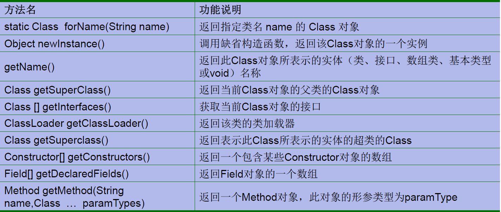
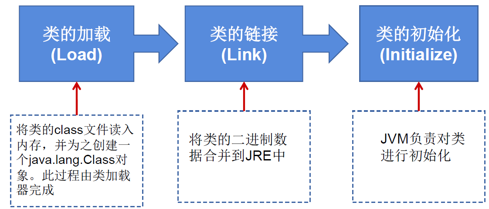
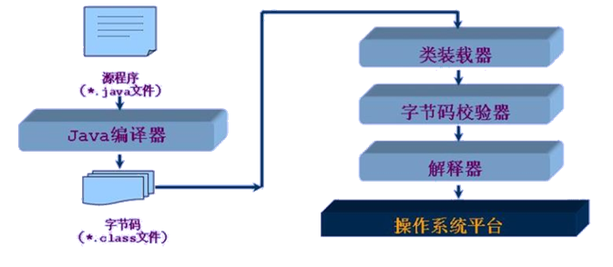
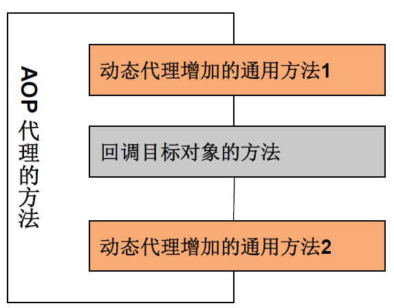

# Java 之反射 


## 一、反射的概述

### 1. 反射的简介

- Reflection（反射) 是被视为动态语言的关键，反射机制允许程序在执行期借助于 Reflection API 取得任何类的内部信息，并能直接操作任意对象的内部属性及方法。
- 加载完类之后，在堆内存的方法区中就产生了一个 Class 类型的对象（一个类只有一个 Class 对象），这个对象就包含了完整的类的结构信息。我们可以通过这个对象看到类的结构。这个对象就像一面镜子，透过这个镜子看到类的结构，所以，我们形象的称之为：反射。

通常的方式：引入需要的 “包类” 名称 ---->通过 “new” 实例化 ---->获得实例化对象

反射的方式：实例化对象 ---->getClass()方法 ---->得到完整的 “包类” 名称

框架 = 注解 + 反射 + 设计模式

### 2. 反射动态性体现

只有当程序运行时我们才能知道调用的类

```java
@Test
public void test2(){

    for(int i = 0;i < 100;i++){
        int num = new Random().nextInt(3);//0,1,2
        String classPath = "";
        switch(num){
            case 0:
                classPath = "java.util.Date";
                break;
            case 1:
                classPath = "java.lang.Object";
                break;
            case 2:
                classPath = "com.atguigu.java.Person";
                break;
        }

        try {
            Object obj = getInstance(classPath);
            System.out.println(obj);
        } catch (Exception e) {
            e.printStackTrace();
        }
    }
}

/*
    创建一个指定类的对象。
    classPath:指定类的全类名
     */
public Object getInstance(String classPath) throws Exception {
    Class clazz =  Class.forName(classPath);
    return clazz.newInstance();
}
```

### 3. 反射机制提供的功能

- 在运行时判断任意一个对象所属的类
- 在运行时构造任意一个类的对象
- 在运行时判断任意一个类所具有的成员变量和方法
- 在运行时获取泛型信息
- 在运行时调用任意一个对象的成员变量和方法
- 在运行时处理注解
- 生成动态代理

**代码示例**

```java
@Test
public void test1() throws Exception {
    Class<Person> clazz = Person.class;
    //1.通过反射，创建Person类对象
    Constructor<Person> cons = clazz.getConstructor(String.class, int.class);
    Person person = cons.newInstance("Tom", 12);
    System.out.println(person);//Person{name='Tom', age=12}

    //2.通过反射，调用对象指定的属性、方法
    //调用属性
    Field age = clazz.getDeclaredField("age");
    age.setAccessible(true);
    age.set(person, 10);
    System.out.println(person.toString());//Person{name='Tom', age=10}

    //调用方法
    Method show = clazz.getDeclaredMethod("show");
    show.invoke(person);//my name is Tom and age is 10

    System.out.println("===================================");
    //通过反射，可以调用Person类的私有结构的。比如：私有的构造器、方法、属性
    //调用私有的构造器
    Constructor<Person> cons1 = clazz.getDeclaredConstructor(String.class);
    cons1.setAccessible(true);
    Person p1 = cons1.newInstance("Bruce");
    System.out.println(p1);//Person{name='Bruce', age=0}

    //调用私有的属性
    Field name = clazz.getDeclaredField("name");
    name.setAccessible(true);
    name.set(p1, "Jarry");
    System.out.println(p1);

    //调用私有的方法
    Method nation = clazz.getDeclaredMethod("nation", String.class);
    nation.setAccessible(true);
    Object nation1 = (String) nation.invoke(p1, "China");//相当于String nation = p1.showNation("China")
    System.out.println(nation1);//I come from China
}
```

### 4. 相关 API

- java.lang.Class: 反射的源头
- java.lang.reflect.Method
- java.lang.reflect.Field
- java.lang.reflect.Constructor
- ....

## 二、Class 类

### 1. Class 简述

- 在 Object 类中定义了以下的方法，此方法将被所有子类继承：

  public final Class getClass()

- 以上的方法返回值的类型是一个 Class 类，此类是 Java 反射的源头，实际上所谓反射从程序的运行结果来看也很好理解，即可以通过对象反射求出类的名称。

- 对象使用反射后可以得到的信息：某个类的属性、方法和构造器、某个类到底实现了哪些接口。对于每个类而言，JRE 都为其保留一个不变的 Class 类型的对象。一个 Class 对象包含了特定某个结构（ class/interface/enum/annotation/primitive type/void/[]）的有关信息。

  - Class 本身也是一个类
  - Class 对象只能由系统建立对象
  - 一个加载的类在 JVM 中只会有一个 Class 实例
  - 一个 Class 对象对应的是一个加载到 JVM 中的一个. class 文件
  - 每个类的实例都会记得自己是由哪个 Class 实例所生成
  - 通过 Class 可以完整地得到一个类中的所有被加载的结构
  - Class 类是 Reflection 的根源，针对任何你想动态加载、运行的类，唯有先获得相应的 Class 对象

**类的加载过程：**

- 程序经过 javac.exe 命令以后，会生成一个或多个字节码文件 (.class 结尾)。接着我们使用 java.exe 命令对某个字节码文件进行解释运行。相当于将某个字节码文件加载到内存中。此过程就称为类的加载。加载到内存中的类，我们就称为运行时类，此运行时类，就作为 Class 的一个实例。
- 换句话说，Class 的实例就对应着一个运行时类。
- 加载到内存中的运行时类，会缓存一定的时间。在此时间之内，我们可以通过不同的方式来获取此运行时类。

### 2. Class 类的常用方法





**代码示例：**

```java
//创建Class的实例
String str = "test1.Person";
Class clazz = Class.forName(str);
//调用Class的空参构造器创建对象
Object obj = clazz.newInstance;
//获取clazz的name属性
Field field = clazz.getField("name");
field.set(obj,"Jarry");

Object name = filed.get(obj);
System.out.println(name);
//test1.Person为test1包下的Person类
```

### 3. 获取 Class 实例的几种方式：

1）已知具体的类，通过类的 class 属性获取，该方法最为安全可靠，程序性能最高 实例：`Class clazz = String.class;` 2）已知某个类的实例，调用该实例的 getclass() 方法获取 Class 对象 实例：Class clazz=person.getclass(); 3）已知一个类的全类名，且该类在类路径下，可通过 Class 类的静态方法 forName() 获取，可能抛出 `ClassNotFoundException`（比较常用） 实例：`Class clazz = Class.forName(String classPath)` 4）通过类加载器 `ClassLoader cl = this.getclass().getClassLoader();` `Class clazz = cl.loadClass("类的全类名");`

**代码示例**

```java
@Test
public void test2() throws ClassNotFoundException {
    //方式一：调用运行时类的属性：.class
    Class<Person> clazz1 = Person.class;
    System.out.println(clazz1);//class cn.bruce.java.Person

    //方式二：通过运行时类的对象,调用getClass()
    Person p1 = new Person();
    Class<? extends Person> clazz2 = p1.getClass();
    System.out.println(clazz2);//class cn.bruce.java.Person

    //方式三：调用Class的静态方法：forName(String classPath)
    Class<?> clazz3 = Class.forName("cn.bruce.java.Person");
    System.out.println(clazz3);//class cn.bruce.java.Person

    System.out.println(clazz1 == clazz2);//true
    System.out.println(clazz1 == clazz3);//true
    //方式四：使用类的加载器：ClassLoader  (了解)
    ClassLoader classLoader = ReflectionTest.class.getClassLoader();
    Class<?> clazz4 = classLoader.loadClass("cn.bruce.java.Person");
    System.out.println(clazz4);//class cn.bruce.java.Person
    System.out.println(clazz1 == clazz4);//true
}
```

#### 总结：创建类的对象的方式?

方式一：new + 构造器

方式二：要创建 Xxx 类的对象，可以考虑：Xxx、Xxxs、XxxFactory、XxxBuilder 类中查看是否有静态方法的存在。可以调用其静态方法，创建 Xxx 对象。

方式三：通过反射

### 4. Class 实例可以代表的结构

（1）class：外部类，成员（成员内部类，静态内部类），局部内部类，匿名内部类

（2）interface：接口

（3）[]：数组

（4）enum：枚举

（5）annotation：注解 @interface

（6）primitive type：基本数据类型

（7）void

在 Java 中万事万物皆对象

**代码示例**

```java
@Test
public void test3(){
    Class<Object> c1 = Object.class;
    Class<Comparable> c2 = Comparable.class;
    Class<String[]> c3 = String[].class;
    Class<int[][]> c4 = int[][].class;
    Class<ElementType> c5 = ElementType.class;
    Class<Override> c6 = Override.class;
    Class<Integer> c7 = int.class;
    Class<Void> c8 = void.class;
    Class<Class> c9 = Class.class;

    int[] i1 = new int[10];
    int[] i2 = new int[100];
    Class<? extends int[]> c10 = i1.getClass();
    Class<? extends int[]> c11 = i2.getClass();
    // 只要数组的元素类型与维度一样，就是同一个Class
    System.out.println(c10 == c11);//true
}
```

## 三、类的加载

### 1. 类的加载过程

当程序主动使用某个类时，如果该类还未被加载到内存中，则系统会通过以下三个步骤对该类进行初始化。





- 加载：将 class 文件字节码内容加载到内存中，并将这些静态数据转换成方法区的运行时数据结构，然后生成一个代表这个类的 java.lang.Class 对象，作为方法区中类数据的访问入口（即引用地址）。所有需要访问和使用类数据只能通过这个 Class 对象。这个加载的过程需要类加载器参与。
- 链接：将 Java 类的二进制代码合并到 JVM 的运行状态之中的过程。
  - 验证：确保加载的类信息符合 JVM 规范，例如：以 cafe 开头，没有安全方面的问题。
  - 准备：正式为类变量 (static) 分配内存并设置类变量默认初始值的阶段，这些内存都将在方法区中进行分配。
  - 解析：虚拟机常量池内的符号引用（常量名）替换为直接引用（地址）的过程。
- 初始化：
  - 执行类构造器 <clinit>() 方法的过程。类构造器 < clinit>() 方法是由编译期自动收集类中所有类变量的赋值动作和静态代码块中的语句合并产生的。（类构造器是构造类信息的，不是构造该类对象的构造器）。
  - 当初始化一个类的时候，如果发现其父类还没有进行初始化，则需要先触发其父类的初始化。
  - 虚拟机会保证一个类的 <clinit>() 方法在多线程环境中被正确加锁和同步。

**代码示例：**

```java
public class ClassLoadingTest{
    public static void main (String [] args){
        System.out.println(test.m);
    }
}

class test{
    static {
        m = 300;
    }
    static int m = 100;
}
//第一步：加载
//第二步：链接结束后m=0
//第三步：初始化结束后，m的值由<clinit>()方法执行决定
/*
这个test构造器<clinit>()方法由类变量的赋值和静态代码块中的语句按照顺序合并产生，类似于
<clinit>(){
m = 300;
m = 100;
}
*/
```

### 2. Java 类编译、运行的执行的流程





### 3. 类的加载器的作用

- 将 class 文件字节码内容加载到内存中，并将这些静态数据转换成方法区的运行时数据结构，然后在堆中生成一个代表这个类的 java.lang.Class 对象，作为方法区中类数据的访问入口。
- 类缓存：标准的 JavaSE 类加载器可以按要求查找类，但一旦某个类被加载到类加载器中，它将维持加载（缓存）一段时间。不过 JVM 垃圾回收机制可以回收这些 Class 对象

### 4. 类的加载器的分类


```java
@Test
public void test1(){
    //对于自定义类，使用系统类加载器进行加载
    ClassLoader classLoader = ClassLoaderTest.class.getClassLoader();
    System.out.println(classLoader);
    //调用系统类加载器的getParent()：获取扩展类加载器
    ClassLoader classLoader1 = classLoader.getParent();
    System.out.println(classLoader1);
    //调用扩展类加载器的getParent()：无法获取引导类加载器
    //引导类加载器主要负责加载java的核心类库，无法加载自定义类的。
    ClassLoader classLoader2 = classLoader1.getParent();
    System.out.println(classLoader2);

    ClassLoader classLoader3 = String.class.getClassLoader();
    System.out.println(classLoader3);

}
```

### 5. 使用 Classloader 加载 src 目录下的配置文件

```java
@Test
public void test3(){
    Properties pros = new Properties();
    //        //读取配置文件的方式一：
    //        //此时的文件默认在当前的module下。
    //        FileInputStream fis = null;
    //        try {
    //            fis = new FileInputStream("jdbc1.properties");
    //            pros.load(fis);
    //        } catch (IOException e) {
    //            e.printStackTrace();
    //        } finally {
    //            if (fis != null) {
    //                try {
    //                    fis.close();
    //                } catch (IOException e) {
    //                    e.printStackTrace();
    //                }
    //            }
    //        }

    //读取配置文件的方式二：使用ClassLoader
    //配置文件默认识别为：当前module的src下
    ClassLoader classLoader = ClassLoaderTest.class.getClassLoader();
    InputStream is = classLoader.getResourceAsStream("jdbc1.properties");
    try {
        pros.load(is);
    } catch (IOException e) {
        e.printStackTrace();
    }

    String user = pros.getProperty("user");
    String password = pros.getProperty("password");
    System.out.println("user = " + user + " password =" + password);
}
```

## 四、反射的应用

### 1. 创建运行时类的对象

#### 1.1 代码举例

```java
@Test
public void test1() throws Exception {
    //方式一
    Class<Person> clazz1 = Person.class;
    //方式二
    Class<Person> clazz2 = (Class<Person>) Class.forName("cn.bruce.java.Person");

    Person person1 = clazz1.newInstance();
    Person person2 = clazz2.newInstance();
    System.out.println(person1);
    System.out.println(person2);

}
```

#### 1.2 说明

newInstance(): 调用此方法，创建对应的运行时类的对象。内部调用了运行时类的空参的构造器。

要想此方法正常的创建运行时类的对象，要求：

- 运行时类必须提供空参的构造器
- 空参的构造器的访问权限得够。通常，设置为 public。

在 javabean 中要求提供一个 public 的空参构造器。原因：

- 便于通过反射，创建运行时类的对象
- 便于子类继承此运行时类时，默认调用 super() 时，保证父类此构造器

### 2. 获取运行时类的完整结构

我们可以通过反射，获取对应的运行时类中所有的属性、方法、构造器、父类、接口、父类的泛型、包、注解、异常等。。。。

#### 2.1 使用反射可以取得：

1. 实现的全部接口： public Class<?>[] getInterfaces() 确定此对象所表示的类或接口实现的接口。

2. 所继承的父类： public Class<? Super T> getSuperclass() 返回表示此 Class 所表示的实体（类、接口、基本类型）的父类的 Class。

3. 全部的构造器：

   public Constructor<T>[] getConstructors()

   返回此 Class 对象所表示的类的所有 public 构造方法。

   public Constructor<T>[] getDeclaredConstructors()

   返回此 Class 对象表示的类声明的所有构造方法。

   在 Constructor 类中:

   - 取得修饰符：public int getModifiers();
   - 取得方法名称： public String getName();
   - 取得参数的类型： public Class<?> getParameterTypes();

4. 全部的方法：

   public Method[] getDeclaredMethods()

   返回此 Class 对象所表示的类或接口的全部方法

   public Method[] getMethods()

   返回此 Class 对象所表示的类或接口的 public 的方法

   Method 类中：

   - public Class<?> getReturnType() 取得全部的返回值
   - public Class<?>[] getParameterTypes() 取得全部的参数
   - public int getModifiers() 取得修饰符
   - public Class<?> [] getEXceptionTypes() 取得异常信息

5. 全部的 Field:

   public Field[] getFields()

   返回此 Class 对象所表示的类或接口的 public 的 Field。

   public Field[] getDeclaredFields()

   返回此 Class 对象所表示的类或接口的全部 Field

   Field 方法中

   - public int getModifiers() 以整数形式返回此 Field 的修饰符
   - public Class<?> getType() 得到 Field 的属性类型
   - public String getName() 返回 Field 的名称。

6. Annotation 相关

   get Annotation(Class<T> annotationClass)

   getDeclaredAnnotations()

7. 泛型相关

   获取父类泛型类型：Type getGenericSuperclass()

   泛型类型：ParameterizedType

   获取实际的泛型类型参数数组：getActualTypeArguments()

8. 类所在的包 Package getPackage()

#### 2.2 代码示例

**获取属性 Fieled**

```java
public class FiledTest {
    @Test
    public void test1() {
        Class<Person> clazz = Person.class;
        //获取属性结构
        //getFields():获取当前运行时类及其父类中声明为public访问权限的属性
        Field[] fields = clazz.getFields();
        for (Field f :
             fields) {
            System.out.println(f);
        }
        System.out.println();
        //getDeclaredFields():获取当前运行时类中声明的所有属性。（不包含父类中声明的属性）
        Field[] declaredFields = clazz.getDeclaredFields();
        for (Field f :
             declaredFields) {
            System.out.println(f);
        }
    }

    //权限修饰符  数据类型 变量名
    @Test
    public void test2() throws ClassNotFoundException {
        Class<?> clazz = Class.forName("cn.bruce.java1.Person");
        Field[] declaredFields = clazz.getDeclaredFields();
        for (Field f :
             declaredFields) {
            //1.权限修饰符
            int modifiers = f.getModifiers();
            System.out.print(Modifier.toString(modifiers)+"\t");

            //2.数据类型
            Class<?> type = f.getType();
            System.out.print(type.getName()+"\t");

            //3.变量名
            String fName = f.getName();
            System.out.print(fName);

            System.out.println();
        }
    }
}
```

**获取方法 Method**

```java
public class MethodTest {
    @Test
    public void test1() {
        Class<Person> clazz = Person.class;
        //getMethods():获取当前运行时类及其所有父类中声明为public权限的方法
        Method[] methods = clazz.getMethods();
        for (Method m :
             methods) {
            System.out.println(m);
        }
        System.out.println("============");
        //getDeclaredMethods():获取当前运行时类中声明的所有方法。（不包含父类中声明的方法）
        Method[] declaredMethods = clazz.getDeclaredMethods();
        for (Method m :
             declaredMethods) {
            System.out.println(m);
        }
    }

    /*
    @Xxxx
    权限修饰符  返回值类型  方法名(参数类型1 形参名1,...) throws XxxException{}
     */
    @Test
    public void test2() throws ClassNotFoundException {
        Class<?> clazz = Class.forName("cn.bruce.java1.Person");
        Method[] declaredMethods = clazz.getDeclaredMethods();
        for (Method m :
             declaredMethods) {
            //1.获取方法声明的注解
            Annotation[] annos = m.getAnnotations();
            for (Annotation a :
                 annos) {
                System.out.println(a);
            }

            //2.权限修饰符
            System.out.print(Modifier.toString(m.getModifiers())+"\t");

            //3.返回值类型
            System.out.print(m.getReturnType().getName() + "\t");

            //4.方法名
            System.out.print(m.getName());
            System.out.print("(");

            //5.形参列表
            Class<?>[] parameterTypes = m.getParameterTypes();
            if (!(parameterTypes == null && parameterTypes.length == 0)) {
                for (int i = 0; i < parameterTypes.length; i++) {
                    if (i == parameterTypes.length - 1) {
                        System.out.print(parameterTypes[i].getName() + " args_" + i);
                        break;
                    }
                    System.out.print(parameterTypes[i].getName() + "args_" + i + ",");
                }
            }
            System.out.print(")");

            //6.抛出的异常
            Class<?>[] exceptionTypes = m.getExceptionTypes();
            if (exceptionTypes.length > 0){
                System.out.print("throws ");
                for (int i = 0; i < exceptionTypes.length; i++) {
                    if (i==exceptionTypes.length -1){
                        System.out.print(exceptionTypes[i].getName());
                        break;
                    }
                    System.out.print(exceptionTypes[i].getName()+",");
                }

                System.out.println();
            }


        }
    }
}
```

**获取其他结构**

```java
public class OtherTest {
    /*
    获取构造器结构
     */
    @Test
    public void test1() {
        Class<Person> clazz = Person.class;
        //getConstructors():获取当前运行时类中声明为public的构造器
        Constructor<?>[] constructors = clazz.getConstructors();
        for (Constructor c :
             constructors) {
            System.out.println(c);
        }
        System.out.println("================");
        //getDeclaredConstructors():获取当前运行时类中声明的所有的构造器
        Constructor<?>[] declaredConstructors = clazz.getDeclaredConstructors();
        for (Constructor c :
             declaredConstructors) {
            System.out.println(c);
        }
    }
    /*
    获取运行时类的父类
     */
    @Test
    public void test2(){
        Class<Person> clazz = Person.class;

        Class<? super Person> superclass = clazz.getSuperclass();
        System.out.println(superclass);
    }
    /*
    获取运行时类的带泛型的父类
     */
    @Test
    public void test3(){
        Class<Person> clazz = Person.class;

        Type genericSuperclass = clazz.getGenericSuperclass();
        System.out.println(genericSuperclass);
    }
    /*
    获取运行时类的带泛型的父类的泛型
    代码：逻辑性代码  vs 功能性代码
     */
    @Test
    public void test4(){
        Class clazz = Person.class;

        Type genericSuperclass = clazz.getGenericSuperclass();
        ParameterizedType paramType = (ParameterizedType) genericSuperclass;
        //获取泛型类型
        Type[] actualTypeArguments = paramType.getActualTypeArguments();
        //        System.out.println(actualTypeArguments[0].getTypeName());
        System.out.println(((Class)actualTypeArguments[0]).getName());
    }

    /*
    获取运行时类实现的接口
     */
    @Test
    public void test5(){
        Class clazz = Person.class;

        Class[] interfaces = clazz.getInterfaces();
        for(Class c : interfaces){
            System.out.println(c);
        }

        System.out.println();
        //获取运行时类的父类实现的接口
        Class[] interfaces1 = clazz.getSuperclass().getInterfaces();
        for(Class c : interfaces1){
            System.out.println(c);
        }

    }
    /*
        获取运行时类所在的包
     */
    @Test
    public void test6(){
        Class clazz = Person.class;

        Package pack = clazz.getPackage();
        System.out.println(pack);
    }

    /*
        获取运行时类声明的注解
     */
    @Test
    public void test7(){
        Class clazz = Person.class;

        Annotation[] annotations = clazz.getAnnotations();
        for(Annotation annos : annotations){
            System.out.println(annos);
        }
    }
}
```

### 3. 调用运行时类的指定结构

#### 3.1 调用指定的属性

在反射机制中，可以直接通过 Field 类操作类中的属性，通过 Field 类提供的 set() 和 get() 方法就可以完成设置和取得属性内容的操作。

- public Field getField(String name) 返回此 Class 对象表示的类或接口的指定的 public 的 Field。

- public Field getDeclaredField(String name) 返回此 Class 对象表示的类或接口的指定的 Field。

  在 Field 中:

- public Object get(object obj) 取得指定对象 obj 上此 Field 的属性内容

- public void set(Object obj,Object value) 设置指定对象 obj 上此 Field 的属性内容

**代码示例**

```java
@Test
public void testField() throws Exception {
    Class clazz = Person.class;

    //创建运行时类的对象
    Person p = (Person) clazz.newInstance();

    //1. getDeclaredField(String fieldName):获取运行时类中指定变量名的属性
    Field name = clazz.getDeclaredField("name");

    //2.保证当前属性是可访问的
    name.setAccessible(true);
    //3.获取、设置指定对象的此属性值
    name.set(p,"Tom");

    System.out.println(name.get(p));
}
```

#### 3.2 调用指定的方法（常用）

通过反射，调用类中的方法，通过 Method 类完成。步骤:

1. 通过 Class 类的 getMethod(String name,Class… parameterTypes) 方法取得一个 Method 对象，并设置此方法操作时所需要的参数类型。
2. 之后使用 Object invoke(Object obj， Object[] args) 进行调用，并向方法中传递要设置的 ob 对象的参数信息。


**Object invoke(object obj,Object... args) 方法：**

1. Object 对应原方法的返回值，若原方法无返回值，此时返回 null
2. 若原方法若为静态方法，此时形参 Object obj 可为 null
3. 若原方法形参列表为空，则 Object[] args 为 null
4. 若原方法声明为 private，则需要在调用此 invoke() 方法前，显式调用方法对象的 setAccessible(true) 方法，将可访问 private 的方法。

**关于 setAccessible 方法的使用：**

- Method 和 Field、Constructor 对象都有 setAccessible() 方法。
- setAccessible 是启动和禁用访问安全检查的开关
- 参数值为 true 则指示反射的对象在使用时应该取消 Java 语言访问检査。
- 提高反射的效率。如果代码中必须用反射，而该句代码需要频繁的被调用，那么请设置为 true. 使得原本无法访问的私有成员也可以访问
- 参数值为 false 则指示反射的对象应该实施 Java 语言访问检査。

**代码示例**

```java
@Test
public void testMethod() throws Exception {
    Class<Person> clazz = Person.class;

    //创建运行时类的对象
    Person person = clazz.newInstance();

    /*
        1.获取指定的某个方法
        getDeclaredMethod():参数1 ：指明获取的方法的名称  参数2：指明获取的方法的形参列表
         */
    Method show = clazz.getDeclaredMethod("show", String.class);

    //2.保证当前方法是可访问的
    show.setAccessible(true);

    /*
        3. 调用方法的invoke():参数1：方法的调用者  参数2：给方法形参赋值的实参
        invoke()的返回值即为对应类中调用的方法的返回值。
         */
    Object returnValue = show.invoke(person, "CHN");
    System.out.println(returnValue);

    System.out.println("*************如何调用静态方法*****************");

    Method showDesc = clazz.getDeclaredMethod("showDesc");
    showDesc.setAccessible(true);
    //如果调用的运行时类中的方法没有返回值，则此invoke()返回null
    //Object returnVal = showDesc.invoke(null);
    Object returnVal = showDesc.invoke(Person.class);
    System.out.println(returnVal);
}
```

#### 3.3 调用指定的构造器

**代码示例**

```java
@Test
public void testConstructor() throws Exception {
    Class clazz = Person.class;

    //private Person(String name)
    /*
        1.获取指定的构造器
        getDeclaredConstructor():参数：指明构造器的参数列表
         */

    Constructor constructor = clazz.getDeclaredConstructor(String.class);

    //2.保证此构造器是可访问的
    constructor.setAccessible(true);

    //3.调用此构造器创建运行时类的对象
    Person per = (Person) constructor.newInstance("Tom");
    System.out.println(per);

}
```

### 4. 动态代理

#### 4.1 代理设计模式的原理:

使用一个代理将对象包装起来，然后用该代理对象取代原始对象。任何对原始对象的调用都要通过代理。代理对象决定是否以及何时将方法调用转到原始对象上。

#### 4.2 静态代理

**代码示例：**

```java
interface ClothFactory{
    void produceCloth();
}

//被代理类
class NikeClothFactory implements ClothFactory{

    @Override
    public void produceCloth() {
        System.out.println("Nike 生产衣服");
    }
}

//代理类
class ProxyClothFactory implements ClothFactory{

    private ClothFactory factory;//用被代理类对象进行实例化

    public ProxyClothFactory(ClothFactory factory) {
        this.factory = factory;
    }

    @Override
    public void produceCloth() {
        System.out.println("代理工厂做一些准备工作");

        factory.produceCloth();

        System.out.println("代理工厂做一些后续的收尾工作");

    }
}

//测试
public class StaticProxyTest {
    public static void main(String[] args) {

        //创建被代理类的对象
        ClothFactory nike = new NikeClothFactory();

        //创建代理类的对象
        ProxyClothFactory proxyClothFactory = new ProxyClothFactory(nike);

        proxyClothFactory.produceCloth();
    }
}
```

**静态代理的缺点：**

① 代理类和目标对象的类都是在编译期间确定下来，不利于程序的扩展。

② 每一个代理类只能为一个接口服务，这样一来程序开发中必然产生过多的代理。

#### 4.3 动态代理的特点：

动态代理是指客户通过代理类来调用其它对象的方法，并且是在程序运行时根据需要动态创建目标类的代理对象。

**相比于静态代理的优点：**

抽象角色中（接口）声明的所有方法都被转移到调用处理器一个集中的方法中处理，这样，我们可以更加灵活和统一的处理众多的方法。

#### 4.4 动态代理的实现

##### 4.4.1 需要解决的两个主要问题：

问题一：如何根据加载到内存中的被代理类，动态的创建一个代理类及其对象。

（通过 `Proxy.newProxyInstance()` 实现）

问题二：当通过代理类的对象调用方法 a 时，如何动态的去调用被代理类中的同名方法。

（通过 `InvocationHandler` 接口的实现类及其方法 `invoke()` )

##### 4.4.2 动态代理相关的 API：

Proxy：专门完成代理的操作类，是所有动态代理类的父类。通过此类为一个或多个接口动态地生成实现类。提供用于创建动态代理类和动态代理对象的静态方法。

- `static Class<?> getProxyClass(ClassLoader loader, Class<?>...interface)` 创建一个动态代理类所对应的 Class 对象
- `static Object newProxyInstance(ClassLoader loader, Class<?>...interface, InvocationHandler h)` 直接创建一个动态代理对象

##### 4.4.3 动态代理实现步骤：

1. 创建一个实现接口 `InvocationHandler` 的类，它必须实现 invoke 方法，以完成代理的具体操作。
2. 创建被代理类以及接口
3. 通过 Proxy 的静态方法 `newProxyInstance(ClassLoader loader, Class<?>...interface, InvocationHandler h)` 创建一个接口代理
4. 通过代理类的实例调用被代理类的方法

##### 4.4.2 代码实现：

```java
interface Human {
    String getBelief();

    void eat(String food);
}

//被代理类
class SuperMan implements Human {

    @Override
    public String getBelief() {
        return "I believe I can fly!";
    }

    @Override
    public void eat(String food) {
        System.out.println("I like eat " + food);
    }
}

/*
要想实现动态代理，需要解决的问题？
问题一：如何根据加载到内存中的被代理类，动态的创建一个代理类及其对象。
问题二：当通过代理类的对象调用方法a时，如何动态的去调用被代理类中的同名方法a。
 */

//创建继承了InvocationHandler接口的类
class MyInvocationHanlder implements InvocationHandler {
    private Object obj;//需要使用被代理类的对象进行赋值

    public void bind(Object obj) {
        this.obj = obj;
    }
    //当我们通过代理类的对象，调用方法a时，就会自动的调用如下的方法：invoke()
    //将被代理类要执行的方法a的功能就声明在invoke()中
    @Override
    public Object invoke(Object proxy, Method method, Object[] args) throws Throwable {

        //method:即为代理类对象调用的方法，此方法也就作为了被代理类对象要调用的方法
        //obj:被代理类的对象
        Object returnValue = method.invoke(obj, args);

        //上述方法的返回值就作为当前类中的invoke()的返回值。
        return returnValue;
    }
}

class ProxyFactory {
    //调用此方法，返回一个代理类的对象。解决问题一
    public static Object getProxyInstance(Object obj) {
        MyInvocationHanlder hanlder = new MyInvocationHanlder();
        hanlder.bind(obj);
        return Proxy.newProxyInstance(obj.getClass().getClassLoader(),obj.getClass().getInterfaces(),hanlder);

    }
}

//测试动态代理
public class ProxyTest {
    public static void main(String[] args) {
        SuperMan superMan = new SuperMan();
        //proxyInstance:代理类的对象
        Human proxyInstance = (Human) ProxyFactory.getProxyInstance(superMan);
        //当通过代理类对象调用方法时，会自动的调用被代理类中同名的方法
        String belief = proxyInstance.getBelief();
        System.out.println(belief);
        proxyInstance.eat("火锅");
    }
}
```

#### 5. 动态代理与 AOP

- 使用 Proxy 生成一个动态代理时，往往并不会凭空产生一个动态代理，这样没有太大的意义。通常都是为指定的目标对象生成动态代理。
- 这种动态代理在 AOP 中被称为 AOP 代理，AOP 代理可代替目标对象，AOP 代理包含了目标对象的全部方法。但 AOP 代理中的方法与目标对象的方法存在差异：
- AOP 代理里的方法可以在执行目标方法之前、之后插入一些通用处理





**代码示例**

```java
//公共接口
interface Dog {
    void info();

    void run();
}

//被代理类
class HuntingDog implements Dog {

    @Override
    public void info() {
        System.out.println("我是一只猎狗");
    }

    @Override
    public void run() {
        System.out.println("我跑的很快");
    }
}

//通用方法
class DogUtils {
    public void method1() {
        System.out.println("=======通用方法一=======");
    }

    public void method2() {
        System.out.println("=======通用方法二=======");
    }
}

//动态代理实现
class MyInvocationHandler1 implements InvocationHandler {
    //需要被代理的对象
    private Object target;

    public void SetTarget(Object target) {
        this.target = target;
    }

    //当我们通过代理类的对象，调用方法a时，就会自动的调用如下的方法：invoke()
    //将被代理类要执行的方法a的功能就声明在invoke()中
    @Override
    public Object invoke(Object proxy, Method method, Object[] args) throws Throwable {
        DogUtils dogUtils = new DogUtils();
        //执行DogUtils对象中的method1
        dogUtils.method1();
        //通过obj对象来调用执行method方法
        Object result = method.invoke(target, args);
        //执行DogUtils对象中的method2
        dogUtils.method2();
        return result;
    }
}

//动态代理类
class MyProxyFactory1 {
    //为target生成动态代理对象
    public static Object getProxy(Object target) {
        //创建一个MyInvocationHandler对象
        MyInvocationHandler1 handler = new MyInvocationHandler1();
        //为MyInvocationHandler设置target对象
        handler.SetTarget(target);
        //创建返回一个动态代理对象
        return Proxy.newProxyInstance(target.getClass().getClassLoader(), target.getClass().getInterfaces(), handler);
    }
}

public class AOPTest {
    public static void main(String[] args) {
        Dog target = new HuntingDog();
        Dog dog = (Dog) MyProxyFactory1.getProxy(target);
        dog.info();
        dog.run();
    }
}
```


全文完