# Java 之集合 


## 一、集合与数组

### 1. 集合与数组存储数据概述：

集合、数组都是对多个数据进行存储操作的结构，简称 Java 容器。 说明：此时的存储，主要指的是内存层面的存储，不涉及到持久化的存储（.txt,.jpg,.avi，数据库中)

### 2. 数组存储的特点：

一旦初始化以后，其长度就确定了。 数组一旦定义好，其元素的类型也就确定了。我们也就只能操作指定类型的数据了。

比如：String[] arr;int[] arr1;Object[] arr2;

### 3. 数组存储的弊端：

1. 一旦初始化以后，其长度就不可修改。
2. 数组中提供的方法非常限，对于添加、删除、插入数据等操作，非常不便，同时效率不高。
3. 获取数组中实际元素的个数的需求，数组没有现成的属性或方法可用
4. 数组存储数据的特点：有序、可重复。对于无序、不可重复的需求，不能满足。

### 4. 集合存储的优点：

解决数组存储数据方面的弊端。

### 5. 集合的分类

Java 集合可分为 Collection 和 Map 两种体系

- Collection 接口：单列数据，定义了存取一组对象的方法的集合
  - List：元素有序、可重复的集合
  - Set：元素无序、不可重复的集
- Map 接口：双列数据，保存具有映射关系 “key-value 对” 的集合

### 6. 集合的框架结构

```java
|----Collection接口：单列集合，用来存储一个一个的对象
     |----List接口：存储有序的、可重复的数据。  -->“动态”数组
           |----ArrayList：作为List接口的主要实现类，线程不安全的，效率高;底层采用Object[] elementData数组存储
           |----LinkedList：对于频繁的插入删除操作，使用此类效率比ArrayList效率高底层采用双向链表存储
           |----Vector：作为List的古老实现类，线程安全的，效率低;底层采用Object[]数组存储
           
     |----Set接口：存储无序的、不可重复的数据   -->数学概念上的“集合”
           |----HashSet：作为Set接口主要实现类;线程不安全;可以存null值
           		|----LinkedHashSet：作为HashSet的子类;遍历其内部数据时，可以按照添加顺序遍历;对于频繁的遍历操作，LinkedHashSet效率高于HashSet.
           |----TreeSet：可以按照添加对象的指定属性，进行排序。


|----Map:双列数据，存储key-value对的数据   ---类似于高中的函数：y = f(x)
     |----HashMap:作为Map的主要实现类；线程不安全的，效率高；存储null的key和value
          |----LinkedHashMap:保证在遍历map元素时，可以照添加的顺序实现遍历。
                    原因：在原的HashMap底层结构基础上，添加了一对指针，指向前一个和后一个元素。
                    对于频繁的遍历操作，此类执行效率高于HashMap。
     |----TreeMap:保证照添加的key-value对进行排序，实现排序遍历。此时考虑key的自然排序或定制排序
                      底层使用红黑树
     |----Hashtable:作为古老的实现类；线程安全的，效率低；不能存储null的key和value
          |----Properties:常用来处理配置文件。key和value都是String类型
```

## 二、Collection 接口

- Collection 接口是 List、Set 和 Queue 接口的父接口，该接口里定义的方法既可用于操作 Set 集合，也可用于操作 List 和 Queue 集合。
- JDK 不提供此接口的任何直接实现，而是提供更具体的子接口（如：Set 和 List）实现。
- 在 JDK 5.0 之前，Java 集合会丢失容器中所有对象的数据类型，把所有对象都当成 Object 类型处理；从 JDK 5.0 增加了泛型以后，Java 集合可以记住容器中对象的数据类型。

### 1. 单列集合框架结构

```java
|----Collection接口：单列集合，用来存储一个一个的对象
     |----List接口：存储有序的、可重复的数据。  -->“动态”数组
           |----ArrayList：作为List接口的主要实现类，线程不安全的，效率高;底层采用Object[] elementData数组存储
           |----LinkedList：对于频繁的插入删除操作，使用此类效率比ArrayList效率高底层采用双向链表存储
           |----Vector：作为List的古老实现类，线程安全的，效率低;底层采用Object[]数组存储
           
     |----Set接口：存储无序的、不可重复的数据   -->数学概念上的“集合”
           |----HashSet：作为Set接口主要实现类;线程不安全;可以存null值
           		|----LinkedHashSet：作为HashSet的子类;遍历其内部数据时，可以按照添加顺序遍历;对于频繁的遍历操作，LinkedHashSet效率高于HashSet.
           |----TreeSet：可以按照添加对象的指定属性，进行排序。
```

图示：


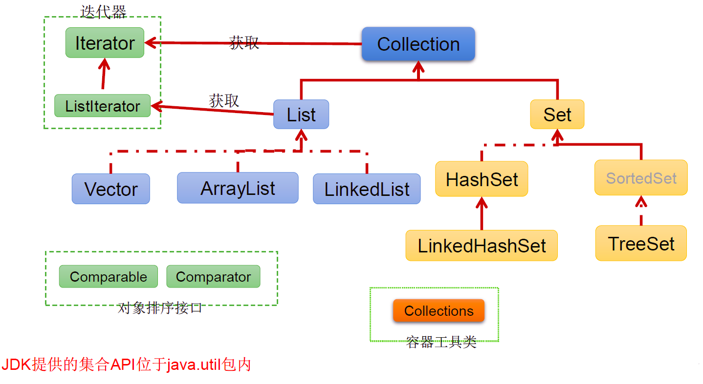


### 2. Collection 接口常用方法：

1. 添加
   - add(Object obj)
   - addAll(Collection coll)
2. 获取有效元素个数
   - int size()
3. 清空集合
   - void clear()
4. 是否为空集合
   - boolean isEmpty()
5. 是否包含某个元素
   - boolean contains(Object obj): 是通过元素的 equals 方法来判断是否是同一个对象
   - boolean containsAll(Collection c): 也是调用元素的 equals 方法来比较的。用两个两个集合的元素逐一比较
6. 删除
   - boolean remove(Object obj): 通过元素的 equals 方法判断是否是要删除的那个元素。只会删除找到的第一个元素
   - boolean removeAll(Collection coll): 取当前集合的差集
7. 取两个集合的交集
   - boolean retainAll(Collection c): 把交集的结果存在当前的集合中，不影响 c
8. 集合是否相等
   - boolean equals(Object obj)
9. 转换成对象数组
   - Object [] toArray()
10. 获取集合对象的哈希值

```java
-   hashCode()
```

1. 遍历

```java
-   iterator():返回迭代器对象，用于集合遍历
```

代码示例：

```java
@Test
public void test1() {
    Collection collection = new ArrayList();
    //1.add(Object e):将元素添加到集合中
    collection.add("ZZ");
    collection.add("AA");
    collection.add("BB");
    collection.add(123);
    collection.add(new Date());
    //2.size():获取添加元素的个数
    System.out.println(collection.size());//5
    //3.addAll(Collection coll1):将coll1集合中的元素添加到当前集合中
    Collection collection1 = new ArrayList();
    collection1.add("CC");
    collection1.add(213);
    collection.addAll(collection1);
    System.out.println(collection.size());//9
    //调用collection1中的toString()方法输出
    System.out.println(collection);//[ZZ, AA, BB, 123, Tue Apr 28 09:22:34 CST 2020, 213, 213]
    //4.clear():清空集合元素
    collection1.clear();
    System.out.println(collection1.size());//0
    System.out.println(collection1);//[]
    //5.isEmpty():判断当前集合是否为空
    System.out.println(collection1.isEmpty());//true
}

@Test
public void test2() {
    Collection coll = new ArrayList();
    coll.add(123);
    coll.add(456);
    coll.add(new Person("Tom", 23));
    coll.add(new Person("Jarry", 34));
    coll.add(false);
    //6.contains(Object obj):判断当前集合中是否包含obj
    //判断时需要调用obj对象所在类的equals()方法
    System.out.println(coll.contains(123));//true
    System.out.println(coll.contains(new Person("Tom", 23)));//true
    System.out.println(coll.contains(new Person("Jarry", 23)));//false
    //7.containsAll(Collection coll1):判断形参coll1中的元素是否都存在当前集合中
    Collection coll1 = Arrays.asList(123, 4566);
    System.out.println(coll.containsAll(coll1));//flase
    //8.remove(Object obj):从当前集合中移除obj元素
    coll.remove(123);
    System.out.println(coll);//[456, Person{name='Tom', age=23}, Person{name='Jarry', age=34}, false]
    //9.removeAll(Collection coll1):差集：从当前集合中和coll1中所有的元素
    Collection coll2 = Arrays.asList(123, 456, false);
    coll.removeAll(coll2);
    System.out.println(coll);//[Person{name='Tom', age=23}, Person{name='Jarry', age=34}]
}

@Test
public void test3() {
    Collection coll = new ArrayList();
    coll.add(123);
    coll.add(456);
    coll.add(new Person("Tom", 23));
    coll.add(new Person("Jarry", 34));
    coll.add(false);
    //10.retainAll(Collection coll1):交集：获取当前集合和coll1集合的交集，并返回给当前集合
    Collection coll1 = Arrays.asList(123, 345, 456);
    boolean b = coll.retainAll(coll1);
    System.out.println(b);//true
    System.out.println(coll);//[123, 456]
    //11.equals(Object obj):返回true需要当前集合和形参集合的元素相同
    Collection coll2 = new ArrayList();
    coll2.add(123);
    coll2.add(456);
    System.out.println(coll.equals(coll2));//true
    //12.hashCode():返回当前对象的哈希值
    System.out.println(coll.hashCode());//5230
    //13.集合--->数组:toArray()
    Object[] array = coll.toArray();
    for (Object obj : array) {
        System.out.println(obj);
    }
    //14.数组--->集合:调用Arrays类的静态方法asList()
    List<int[]> ints = Arrays.asList(new int[]{123, 345});
    System.out.println(ints.size());//1
    List<String> strings = Arrays.asList("AA", "BB", "CC");
    System.out.println(strings);//[AA, BB, CC]
    //15.iteratoriterator():返回Iterator接口的实例，用于遍历集合元素。
}
```

### 3. Collection 集合与数组间的转换

```java
//集合 --->数组：toArray()
Object[] arr = coll.toArray();
for(int i = 0;i < arr.length;i++){
    System.out.println(arr[i]);
}

//拓展：数组 --->集合:调用Arrays类的静态方法asList(T ... t)
List<String> list = Arrays.asList(new String[]{"AA", "BB", "CC"});
System.out.println(list);

List arr1 = Arrays.asList(new int[]{123, 456});
System.out.println(arr1.size());//1

List arr2 = Arrays.asList(new Integer[]{123, 456});
System.out.println(arr2.size());//2
```

使用 Collection 集合存储对象，要求对象所属的类满足：

向 Collection 接口的实现类的对象中添加数据 obj 时，要求 obj 所在类要重写 equals()。

## 三、Iterator 接口与 foreach 循环

### 1. 遍历 Collection 的两种方式：

① 使用迭代器 Iterator ② foreach 循环（或增强 for 循环）

### 2. java.utils 包下定义的迭代器接口：Iterator

#### 2.1 说明：

Iterator 对象称为迭代器 (设计模式的一种)，主要用于遍历 Collection 集合中的元素。 GOF 给迭代器模式的定义为：提供一种方法访问一个容器(container) 对象中各个元素，而又不需暴露该对象的内部细节。迭代器模式，就是为容器而生。

#### 2.2 作用：

遍历集合 Collectiton 元素

#### 2.3 如何获取实例：

coll.iterator() 返回一个迭代器实例

#### 2.4 遍历的代码实现：

```java
Iterator iterator = coll.iterator();
//hasNext():判断是否还下一个元素
while(iterator.hasNext()){
    //next():①指针下移 ②将下移以后集合位置上的元素返回
    System.out.println(iterator.next());
}
```

#### 2.5 图示说明：


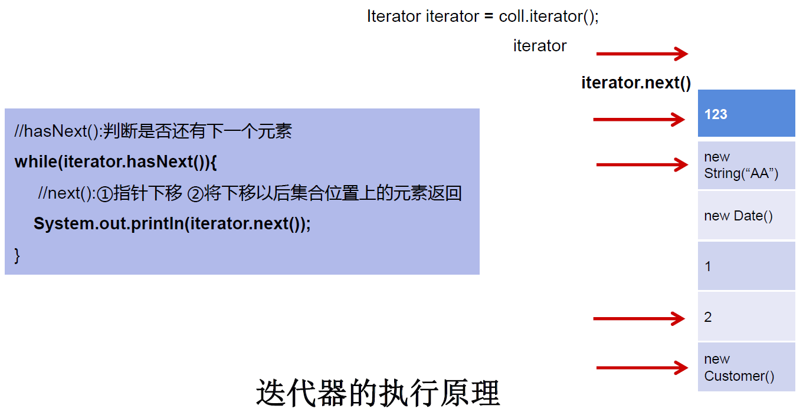


#### 2.6 iterator 中 remove() 方法的使用：

- 测试 Iterator 中的 remove()
- 如果还未调用 next() 或在上一次调用 next 方法之后已经调用了 remove 方法，再调用 remove 都会报 IllegalStateException。
- 内部定义了 remove(), 可以在遍历的时候，删除集合中的元素。此方法不同于集合直接调用 remove()

代码示例：

```java
@Test
public void test3(){
    Collection coll = new ArrayList();
    coll.add(123);
    coll.add(456);
    coll.add(new Person("Jerry",20));
    coll.add("Tom"
            );
    coll.add(false);

    //删除集合中"Tom"
    Iterator iterator = coll.iterator();
    while (iterator.hasNext()){
        //            iterator.remove();
        Object obj = iterator.next();
        if("Tom".equals(obj)){
            iterator.remove();
            //                iterator.remove();
        }

    }
    //将指针重新放到头部，遍历集合
    iterator = coll.iterator();
    while (iterator.hasNext()){
        System.out.println(iterator.next());
    }
}
```

### 3. JDK 5.0 新特性 -- 增强 for 循环：(foreach 循环)

#### 3.1 遍历集合举例：

```java
@Test
public void test1(){
    Collection coll = new ArrayList();
    coll.add(123);
    coll.add(456);
    coll.add(new Person("Jerry",20));
    coll.add(new String("Tom"));
    coll.add(false);

    //for(集合元素的类型 局部变量 : 集合对象)
    
    for(Object obj : coll){
        System.out.println(obj);
    }
}
```

说明：内部仍然调用了迭代器。

#### 3.2. 遍历数组举例：

```java
@Test
public void test2(){
    int[] arr = new int[]{1,2,3,4,5,6};
    //for(数组元素的类型 局部变量 : 数组对象)
    for(int i : arr){
        System.out.println(i);
    }
}
```

## 四、Collection 子接口：List 接口

### 1. 存储的数据特点：

存储序有序的、可重复的数据。

- 鉴于 Java 中数组用来存储数据的局限性，我们通常使用 List 替代数组
- List 集合类中元素有序、且可重复，集合中的每个元素都有其对应的顺序索引。
- List 容器中的元素都对应一个整数型的序号记载其在容器中的位置，可以根据序号存取容器中的元素。
- JDK AP 中 List 接口的实现类常用的有：ArrayList、LinkedList 和 Vector.

### 2. 常用方法：

List 除了从 Collection 集合继承的方法外，List 集合里添加了一些根据索引来操作集合元素的方法。

- void add(int index, Object ele): 在 index 位置插入 ele 元素
- boolean addAll(int index, Collection eles): 从 index 位置开始将 eles 中的所有元素添加进来
- Object get(int index): 获取指定 index 位置的元素
- int indexOf(Object obj): 返回 obj 在集合中首次出现的位置
- int lastIndexOf(Object obj): 返回 obj 在当前集合中末次出现的位置
- Object remove(int index): 移除指定 index 位置的元素，并返回此元素
- Object set(int index, Object ele): 设置指定 index 位置的元素为 ele
- List subList(int fromIndex, int toIndex): 返回从 fromIndex 到 toIndex 位置的子集合

总结：

- 增：add(Object obj)
- 删：remove(int index) / remove(Object obj)
- 改：set(int index, Object ele)
- 查：get(int index)
- 插：add(int index, Object ele)
- 长度：size()
- 遍历： ① Iterator 迭代器方式② foreach（增强 for 循环） ③ 普通的循环

代码示例：

```java
@Test
public void test2(){
    ArrayList list = new ArrayList();
    list.add(123);
    list.add(456);
    list.add("AA");
    list.add(new Person("Tom",12));
    list.add(456);
    //int indexOf(Object obj):返回obj在集合中首次出现的位置。如果不存在，返回-1.
    int index = list.indexOf(4567);
    System.out.println(index);

    //int lastIndexOf(Object obj):返回obj在当前集合中末次出现的位置。如果不存在，返回-1.
    System.out.println(list.lastIndexOf(456));

    //Object remove(int index):移除指定index位置的元素，并返回此元素
    Object obj = list.remove(0);
    System.out.println(obj);
    System.out.println(list);

    //Object set(int index, Object ele):设置指定index位置的元素为ele
    list.set(1,"CC");
    System.out.println(list);

    //List subList(int fromIndex, int toIndex):返回从fromIndex到toIndex位置的左闭右开区间的子集合
    List subList = list.subList(2, 4);
    System.out.println(subList);
    System.out.println(list);
}


@Test
public void test1(){
    ArrayList list = new ArrayList();
    list.add(123);
    list.add(456);
    list.add("AA");
    list.add(new Person("Tom",12));
    list.add(456);

    System.out.println(list);

    //void add(int index, Object ele):在index位置插入ele元素
    list.add(1,"BB");
    System.out.println(list);

    //boolean addAll(int index, Collection eles):从index位置开始将eles中的所有元素添加进来
    List list1 = Arrays.asList(1, 2, 3);
    list.addAll(list1);
    //        list.add(list1);
    System.out.println(list.size());//9

    //Object get(int index):获取指定index位置的元素
    System.out.println(list.get(0));

}
```

### 3. 常用实现类：

```java
3. 常用实现类：
|----Collection接口：单列集合，用来存储一个一个的对象
  |----List接口：存储序的、可重复的数据。  -->“动态”数组,替换原的数组
      |----ArrayList：作为List接口的主要实现类；线程不安全的，效率高；底层使用Object[] elementData存储
      |----LinkedList：对于频繁的插入、删除操作，使用此类效率比ArrayList高；底层使用双向链表存储
      |----Vector：作为List接口的古老实现类；线程安全的，效率低；底层使用Object[] elementData存储
```

#### 3.1 ArrayList

- ArrayList 是 List 接口的典型实现类、主要实现类
- 本质上，ArrayList 是对象引用的一个” 变长” 数组
- Array Listi 的 JDK 1.8 之前与之后的实现区别？
  - JDK 1.7：ArrayList 像饿汉式，直接创建一个初始容量为 10 的数组
  - JDK 1.8：ArrayList 像懒汉式，一开始创建一个长度为 0 的数组，当添加第一个元素时再创建一个始容量为 10 的数组
- Arrays.asList（...）方法返回的 List 集合，既不是 ArrayList 实例，也不是 Vector 实例。Arrays.asList（...）返回值是一个固定长度的 List 集合

代码示例：

```java
@Test
public void test1() {
    Collection coll = new ArrayList();
    coll.add(123);
    coll.add(345);
    coll.add(new User("Tom", 34));
    coll.add(new User("Tom"));
    coll.add(false);
    //iterator()遍历ArrayList集合
    Iterator iterator = coll.iterator();
    while (iterator.hasNext()) {
        System.out.println(iterator.next());
    }
}
```

#### 3.2 linkedList

- 对与对于频繁的插入和删除元素操作，建议使用 LinkedList 类，效率更高
- 新增方法：
  - void addFirst(Object obj)
  - void addLast(Object obj)
  - Object getFirst()
  - Object getlast)()
  - Object removeFirst()
  - Object removeLast()
- Linkedlist：双向链表，内部没有声明数组，而是定义了 Node 类型的 frst 和 last，用于记录首末元素。同时，定义内部类 Node，作为 Linkedlist 中保存数据的基本结构。Node 除了保存数据，还定义了两个变量：
  - prev 变量记录前一个元素的位置
  - next 变量记录下一个元素的位置


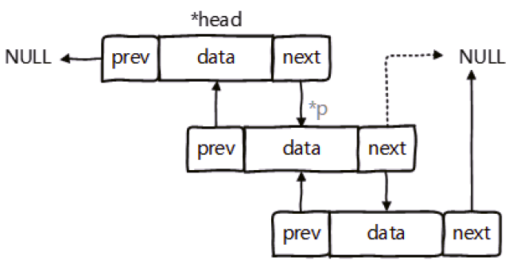


代码示例：

```java
@Test
public void test3(){
    LinkedList linkedList = new LinkedList();
    linkedList.add(123);
    linkedList.add(345);
    linkedList.add(2342);
    linkedList.add("DDD");
    linkedList.add("AAA");
    
    Iterator iterator = linkedList.iterator();
    while (iterator.hasNext()){
        System.out.println(iterator.next());
    }
}
```

### 4. 源码分析 (难点)

#### 4.1 ArrayList 的源码分析：

4.1.1 JDK 7.0 情况下

```java
ArrayList list = new ArrayList();//底层创建了长度是10的Object[]数组elementData
list.add(123);//elementData[0] = new Integer(123);
...
list.add(11);//如果此次的添加导致底层elementData数组容量不够，则扩容。
```

- 默认情况下，扩容为原来的容量的 1.5 倍，同时需要将原有数组中的数据复制到新的数组中。
- 结论：建议开发中使用带参的构造器：ArrayList list = new ArrayList(int capacity)

4.1.2 JDK 8.0 中 ArrayList 的变化：

```java
ArrayList list = new ArrayList();//底层Object[] elementData初始化为{}.并没创建长度为10的数组
list.add(123);//第一次调用add()时，底层才创建了长度10的数组，并将数据123添加到elementData[0]
...
```

后续的添加和扩容操作与 JDK 7.0 无异。

4.1.3 小结：

JDK 7.0 中的 ArrayList 的对象的创建类似于单例的饿汉式，而 JDK 8.0 中的 ArrayList 的对象的创建类似于单例的懒汉式，延迟了数组的创建，节省内存。

#### 4.2 LinkedList 的源码分析：

```java
LinkedList list = new LinkedList(); //内部声明了Node类型的first和last属性，默认值为null
list.add(123);//将123封装到Node中，创建了Node对象。

//其中，Node定义为：体现了LinkedList的双向链表的说法
private static class Node<E> {
    E item;
    Node<E> next;
    Node<E> prev;

    Node(Node<E> prev, E element, Node<E> next) {
        this.item = element;
        this.next = next;
        this.prev = prev;
    }
}
```

#### 4.3 Vector 的源码分析：

- Vector 是一个古老的集合，JDK 1.0 就有了。大多数操作与 ArrayList 相同，区别在于 Vector 是线程安全的
- 在各种 list 中，最好把 ArrayList 作为缺省选择。当插入、删除频繁时，使用 LinkedList；Vector 总是比 ArrayList 慢，所以尽量避免选择使用。
- JDK 7.0 和 JDK 8.0 中通过 Vector() 构造器创建对象时，底层都创建了长度为 10 的数组。
- 在扩容方面，默认扩容为原来的数组长度的 2 倍。

### 5. 存储的元素的要求：

添加的对象，所在的类要重写 equals() 方法

### 6. 面试题

请问 ArrayList/LinkedList/Vector 的异同？谈谈你的理解？ArrayList 底层是什么？扩容机制？ Vector 和 ArrayList 的最大区别？

- ArrayList 和 Linkedlist 的异同：

  二者都线程不安全，相比线程安全的 Vector，ArrayList 执行效率高。 此外，ArrayList 是实现了基于动态数组的数据结构，Linkedlist 基于链表的数据结构。对于随机访问 get 和 set，ArrayList 觉得优于 Linkedlist，因为 Linkedlist 要移动指针。对于新增和删除操作 add（特指插入）和 remove，Linkedlist 比较占优势，因为 ArrayList 要移动数据。

- ArrayList 和 Vector 的区别：

  Vector 和 ArrayList 几乎是完全相同的，唯一的区别在于 Vector 是同步类 (synchronized)，属于强同步类。因此开销就比 ArrayList 要大，访问要慢。正常情况下，大多数的 Java 程序员使用 ArrayList 而不是 Vector，因为同步完全可以由程序员自己来控制。Vector 每次扩容请求其大小的 2 倍空间，而 ArrayList 是 1.5 倍。Vector 还有一个子类 Stack.

## 五、Collection 子接口：Set 接口概述

- Set 接口是 Collection 的子接口，set 接口没有提供额外的方法
- Set 集合不允许包含相同的元素，如果试把两个相同的元素加入同一个 Set 集合中，则添加操作失败。（多用于过滤操作，去掉重复数据）
- Set 判断两个对象是否相同不是使用 == 运算符，而是根据 equals() 方法

### 1. 存储的数据特点：

用于存放无序的、不可重复的元素

以 HashSet 为例说明：

1. 无序性：不等于随机性。存储的数据在底层数组中并非照数组索引的顺序添加，而是根据数据的哈希值决定的。
2. 不可重复性：保证添加的元素照 equals() 判断时，不能返回 true. 即：相同的元素只能添加一个。

### 2. 元素添加过程：(以 HashSet 为例)

我们向 HashSet 中添加元素 a, 首先调用元素 a 所在类的 hashCode() 方法，计算元素 a 的哈希值，此哈希值接着通过某种算法计算出在 HashSet 底层数组中的存放位置（即为：索引位置），判断

数组此位置上是否已经有元素：

- 如果此位置上没有其他元素，则元素 a 添加成功。 ---> 情况 1
- 如果此位置上有其他元素 b(或以链表形式存在的多个元素），则比较元素 a 与元素 b 的 hash 值：
  - 如果 hash 值不相同，则元素 a 添加成功。---> 情况 2
  - 如果 hash 值相同，进而需要调用元素 a 所在类的 equals() 方法：
    - equals() 返回 true, 元素 a 添加失败
    - equals() 返回 false, 则元素 a 添加成功。---> 情况 3

对于添加成功的情况 2 和情况 3 而言：元素 a 与已经存在指定索引位置上数据以链表的方式存储。

JDK 7.0 : 元素 a 放到数组中，指向原来的元素。

JDK 8.0 : 原来的元素在数组中，指向元素 a

总结：七上八下

HashSet 底层：数组 + 链表的结构。（JDK 7.0 以前）


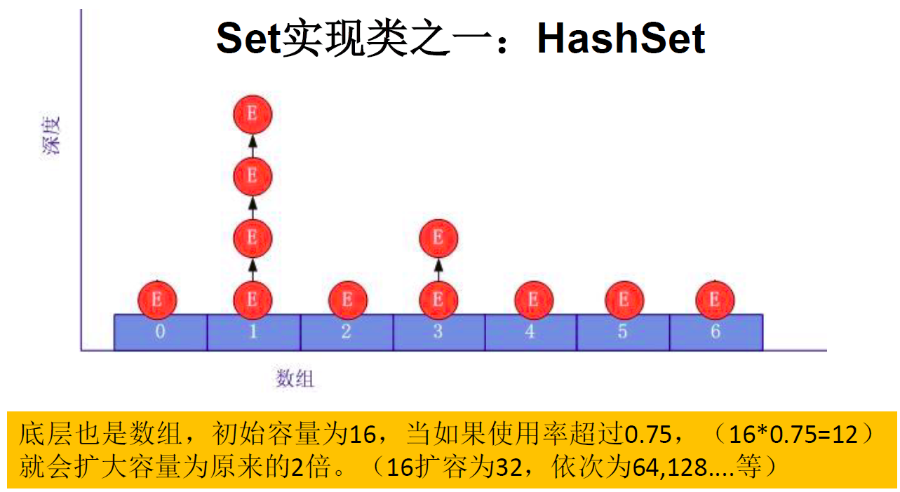


### 3. 常用方法

Set 接口中没额外定义新的方法，使用的都是 Collection 中声明过的方法。

#### 3.1 重写 hashCode() 的基本方法

- 在程序运行时，同一个对象多次调用 hashCode() 方法应该返回相同的值。
- 当两个对象的 equals() 方法比较返回 true 时，这两个对象的 hashCode() 方法的返回值也应相等。
- 对象中用作 equals() 方法比较的 Field，都应该用来计算 hashCode 值。

#### 3.2 重写 equals() 方法基本原则

- 以自定义的 Customer 类为例，何时需要重写 equals()？
- 当一个类有自己特有的 “逻辑相等” 概念，当改写 equals()的时候，总是要改写 hash Code（），根据一个类的 equals 方法 (改写后)，两个截然不同的实例有可能在逻辑上是相等的，但是，根据 Object.hashCode() 方法，它们仅仅是两个对象。
- 因此，违反了 “相等的对象必须具有相等的散列码”.
- 结论：复写 equals 方法的时候一般都需要同时复写 hashCode 方法。通常参与计算 hashCode 的对象的属性也应该参与到 equals() 中进行计算。

#### 3.3 Eclipse/IDEA 工具里 hashCode() 重写

以 Eclipse/DEA 为例，在自定义类中可以调用工具自动重写 equals() 和 hashCode() 问题：为什么用 Eclipse/IDEA 复写 hash Code 方法，有 31 这个数字？

- 选择系数的时候要选择尽量大的系数。因为如果计算出来的 hash 地址越大，所谓的 “冲突” 就越少，查找起来效率也会提高。（减少冲突）
- 并且 31 只占用 5bits，相乘造成数据溢出的概率较小。
- 31 可以由 i*31==(<<5)-1 来表示，现在很多虚拟机里面都有做相关优化。（提高算法效率）
- 31 是一个素数，素数作用就是如果我用一个数字来乘以这个素数，那么最终出来的结果只能被素数本身和被乘数还有 1 来整除！（减少冲突）

代码示例：

```java
@Override
public boolean equals(Object o) {
    System.out.println("User equals()....");
    if (this == o) return true;
    if (o == null || getClass() != o.getClass()) return false;

    User user = (User) o;

    if (age != user.age) return false;
    return name != null ? name.equals(user.name) : user.name == null;
}

@Override
public int hashCode() { //return name.hashCode() + age;
    int result = name != null ? name.hashCode() : 0;
    result = 31 * result + age;
    return result;
}
```

### 4. 常用实现类：

```java
|----Collection接口：单列集合，用来存储一个一个的对象
      |----Set接口：存储无序的、不可重复的数据   -->高中讲的“集合”
           |----HashSet：作为Set接口的主要实现类；线程不安全的；可以存储null值
                |----LinkedHashSet：作为HashSet的子类；遍历其内部数据时，可以按照添加的顺序遍历，对于频繁的遍历操作，LinkedHashSet效率高于HashSet.
           |----TreeSet：可以按照添加对象的指定属性，进行排序。
```

#### 4.1 HashSet

- Hashset 是 Set 接口的典型实现，大多数时候使用 Set 集合时都使用这个实现类。
- HashSet 按 Hash 算法来存储集合中的元素，因此具有很好的存取、查找、删除性能。
- HashSet 具有以下特点：
  - 不能保证元素的排列顺序
  - HashSet 不是线程安全的
  - 集合元素可以是 nul
- HashSet 集合判断两个元素相等的标准：两个对象通过 hashCode() 方法比较相等，并且两个对象的 equals() 方法返回值也相等。
- 对于存放在 Set 容器中的对象，对应的类一定要重写 equals() 和 hashCode(Object obj) 方法，以实现对象相等规则。即：“相等的对象必须具有相等的散列码”

代码示例：

```java
@Test
//HashSet使用
public void test1(){
    Set set = new HashSet();
    set.add(454);
    set.add(213);
    set.add(111);
    set.add(123);
    set.add(23);
    set.add("AAA");
    set.add("EEE");
    set.add(new User("Tom",34));
    set.add(new User("Jarry",74));

    Iterator iterator = set.iterator();
    while (iterator.hasNext()){
        System.out.println(iterator.next());
    }
}
```

#### 4.2 LinkedHashSet

- LinkedhashSet 是 HashSet 的子类
- LinkedhashSet 根据元素的 hashCode 值来决定元素的存储位置但它同时使用双向链表维护元素的次序，这使得元素看起来是以插入顺序保存的。
- LinkedhashSet 插入性能略低于 HashSet，但在迭代访问 Set 里的全部元素时有很好的性能。
- LinkedhashSet 不允许集合元素重复。

图示：


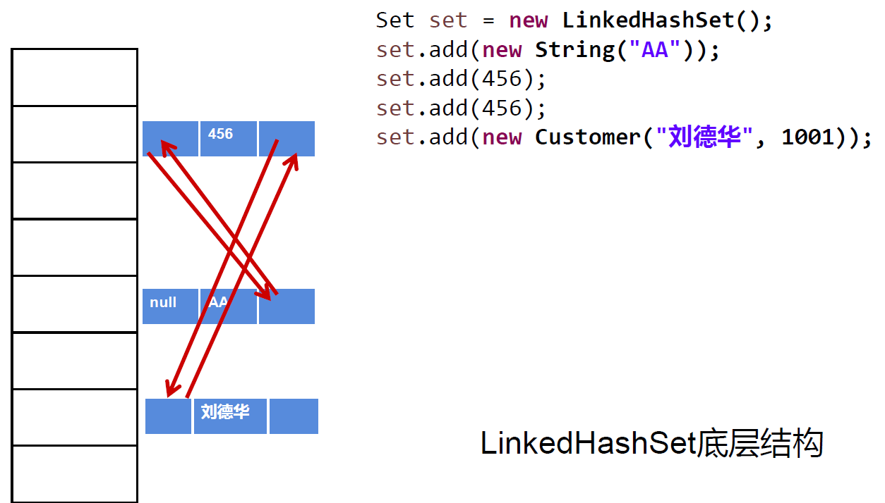


代码示例：

```java
@Test
//LinkedHashSet使用
public void test2(){
    Set set = new LinkedHashSet();
    set.add(454);
    set.add(213);
    set.add(111);
    set.add(123);
    set.add(23);
    set.add("AAA");
    set.add("EEE");
    set.add(new User("Tom",34));
    set.add(new User("Jarry",74));

    Iterator iterator = set.iterator();
    while (iterator.hasNext()){
        System.out.println(iterator.next());
    }
}
```

#### 4.3 TreeSet

- Treeset 是 SortedSet 接口的实现类，TreeSet 可以确保集合元素处于排序状态。
- TreeSet 底层使用红黑树结构存储数据
- 新增的方法如下：（了解）
  - Comparator comparator()
  - Object first()
  - Object last()
  - Object lower(object e)
  - Object higher(object e)
  - SortedSet subSet(fromElement， toElement)
  - SortedSet headSet(toElement)
  - SortedSet tailSet(fromElement)
- TreeSet 两种排序方法：自然排序和定制排序。默认情况下，TreeSet 采用自然排序。

红黑树图示：


红黑树的特点：有序，查询效率比 List 快

详细介绍：https://www.cnblogs.com/LiaHon/p/11203229.html

代码示例：

```java
@Test
public void test1(){
    Set treeSet = new TreeSet();
    treeSet.add(new User("Tom",34));
    treeSet.add(new User("Jarry",23));
    treeSet.add(new User("mars",38));
    treeSet.add(new User("Jane",56));
    treeSet.add(new User("Jane",60));
    treeSet.add(new User("Bruce",58));

    Iterator iterator = treeSet.iterator();
    while (iterator.hasNext()){
        System.out.println(iterator.next());
    }
}
```

### 5. 存储对象所在类的要求：

#### 5.1HashSet/LinkedHashSet:

- 要求：向 Set(主要指：HashSet、LinkedHashSet) 中添加的数据，其所在的类一定要重写 hashCode() 和 equals()
- 要求：重写的 hashCode() 和 equals() 尽可能保持一致性：相等的对象必须具有相等的散列码

重写两个方法的小技巧：对象中用作 equals() 方法比较的 Field，都应该用来计算 hashCode 值。

#### 5.2 TreeSet:

1. 自然排序中，比较两个对象是否相同的标准为：compareTo() 返回 0. 不再是 equals().
2. 定制排序中，比较两个对象是否相同的标准为：compare() 返回 0. 不再是 equals().

### 6. TreeSet 的使用

#### 6.1 使用说明:

1. 向 TreeSet 中添加的数据，要求是相同类的对象。
2. 两种排序方式：自然排序（实现 Comparable 接口 和 定制排序（Comparator）

#### 6.2 常用的排序方式:

方式一：自然排序

- 自然排序：TreeSet 会调用集合元素的 compareTo(object obj) 方法来比较元素之间的大小关系，然后将集合元素按升序（默认情况）排列
- 如果试图把一个对象添加到 Treeset 时，则该对象的类必须实现 Comparable 接口。
  - 实现 Comparable 的类必须实现 compareTo(Object obj) 方法，两个对象即通过 compareTo(Object obj) 方法的返回值来比较大小
- Comparable 的典型实现:
  - BigDecimal、BigInteger 以及所有的数值型对应的包装类：按它们对应的数值大小进行比较
  - Character：按字符的 unic！ode 值来进行比较
  - Boolean：true 对应的包装类实例大于 fase 对应的包装类实例
  - String：按字符串中字符的 unicode 值进行比较
  - Date、Time：后边的时间、日期比前面的时间、日期大
- 向 TreeSet 中添加元素时，只有第一个元素无须比较 compareTo() 方法，后面添加的所有元素都会调用 compareTo() 方法进行比较。
- 因为只有相同类的两个实例才会比较大小，所以向 TreeSet 中添加的应该是同一个类的对象。 对于 TreeSet 集合而言，它判断两个对象是否相等的唯一标准是：两个对象通过 compareTo(Object obj) 方法比较返回值。
- 当需要把一个对象放入 TreeSet 中，重写该对象对应的 equals() 方法时，应保证该方法与 compareTo(Object obj) 方法有一致的结果：如果两个对象通过 equals() 方法比较返回 true，则通过 compareTo(object ob) 方法比较应返回 0。否则，让人难以理解。

```java
@Test
public void test1(){
    TreeSet set = new TreeSet();

    //失败：不能添加不同类的对象
    //        set.add(123);
    //        set.add(456);
    //        set.add("AA");
    //        set.add(new User("Tom",12));

    //举例一：
    //        set.add(34);
    //        set.add(-34);
    //        set.add(43);
    //        set.add(11);
    //        set.add(8);

    //举例二：
    set.add(new User("Tom",12));
    set.add(new User("Jerry",32));
    set.add(new User("Jim",2));
    set.add(new User("Mike",65));
    set.add(new User("Jack",33));
    set.add(new User("Jack",56));


    Iterator iterator = set.iterator();
    while(iterator.hasNext()){
        System.out.println(iterator.next());
    }

}
```

方式二：定制排序

- TreeSet 的自然排序要求元素所属的类实现 Comparable 接口，如果元素所属的类没有实现 Comparable 接口，或不希望按照升序（默认情况）的方式排列元素或希望按照其它属性大小进行排序，则考虑使用定制排序。定制排序，通过 Comparator 接口来实现。需要重写 compare(T o1，T o2) 方法。
- 利用 int compare(T o1，T o2) 方法，比较 o1 和 o2 的大小：如果方法返回正整数，则表示 o1 大于 o2；如果返回 0，表示相等；返回负整数，表示 o1 小于 o2。
- 要实现定制排序，需要将实现 Comparator 接口的实例作为形参传递给 TreeSet 的构造器。
- 此时，仍然只能向 Treeset 中添加类型相同的对象。否则发生 ClassCastException 异常
- 使用定制排序判断两个元素相等的标准是：通过 Comparator 比较两个元素返回了 0

```java
@Test
public void test2(){
    Comparator com = new Comparator() {
        //照年龄从小到大排列
        @Override
        public int compare(Object o1, Object o2) {
            if(o1 instanceof User && o2 instanceof User){
                User u1 = (User)o1;
                User u2 = (User)o2;
                return Integer.compare(u1.getAge(),u2.getAge());
            }else{
                throw new RuntimeException("输入的数据类型不匹配");
            }
        }
    };

    TreeSet set = new TreeSet(com);
    set.add(new User("Tom",12));
    set.add(new User("Jerry",32));
    set.add(new User("Jim",2));
    set.add(new User("Mike",65));
    set.add(new User("Mary",33));
    set.add(new User("Jack",33));
    set.add(new User("Jack",56));

    Iterator iterator = set.iterator();
    while(iterator.hasNext()){
        System.out.println(iterator.next());
    }
}
```

## 六、Map 接口

- Map 与 Collection 并列存在。用于保存具有映射关系的数据: key-value
- Map 中的 key 和 value 都可以是任何引用类型的数据
- Map 中的 key 用 set 来存放，不允许重复，即同一个 Map 对象所对应的类，须重写 hashCode() 和 equals() 方法
- 常用 String 类作为 Map 的 “键”
- key 和 value 之间存在单向一对一关系，即通过指定的 key 总能找到唯一的、确定的 value
- Map 接口的常用实现类: HashMap、TreeMap、LinkedHashMap 和 Properties。其中，HashMap 是 Map 接口使用频率最高的实现类

### 1. 常见实现类结构


```java
|----Map:双列数据，存储key-value对的数据   ---类似于高中的函数：y = f(x)
     |----HashMap:作为Map的主要实现类；线程不安全的，效率高；存储null的key和value
          |----LinkedHashMap:保证在遍历map元素时，可以照添加的顺序实现遍历。
                    原因：在原的HashMap底层结构基础上，添加了一对指针，指向前一个和后一个元素。
                    对于频繁的遍历操作，此类执行效率高于HashMap。
     |----TreeMap:保证照添加的key-value对进行排序，实现排序遍历。此时考虑key的自然排序或定制排序
                      底层使用红黑树
     |----Hashtable:作为古老的实现类；线程安全的，效率低；不能存储null的key和value
          |----Properties:常用来处理配置文件。key和value都是String类型


HashMap的底层： 数组+链表  （JDK 7.0及之前)
               数组+链表+红黑树 （JDK 8.0以后)
```

#### 1.1 HashMap

- HashMap 是 Map 接口使用频率最高的实现类。
- 允许使用 null 键和 null 值，与 HashSet 一样，不保证映射的顺序。
- 所有的 key 构成的集合是 set：无序的、不可重复的。所以，key 所在的类要重写 equals() 和 hashCode()
- 所有的 value 构成的集合是 Collection：无序的、可以重复的。所以，value 所在的类要重写: equals()
- 一个 key-value 构成一个 entry
- 所有的 entry 构成的集合是 Set：无序的、不可重复的
- HashMap 判断两个 key 相等的标准是：两个 key 通过 equals() 方法返回 true，hashCode 值也相等。
- HashMap 判断两个 value 相等的标准是：两个 value 通过 equals() 方法返回 true.

代码示例：

```java
@Test
public void test1(){
    Map map = new HashMap();

    map.put(null,123);

}
```

#### 1.2 LinkedHashMap

- LinkedHashMap 底层使用的结构与 HashMap 相同，因为 LinkedHashMap 继承于 HashMap.
- 区别就在于：LinkedHashMap 内部提供了 Entry，替换 HashMap 中的 Node.
- 与 Linkedhash Set 类似，LinkedHashMap 可以维护 Map 的迭代顺序：迭代顺序与 Key-value 对的插入顺序一致

代码示例：

```java
@Test
public void test2(){
    Map map = new LinkedHashMap();
    map.put(123,"AA");
    map.put(345,"BB");
    map.put(12,"CC");

    System.out.println(map);
}
```

#### 1.3 TreeMap

- TreeMap 存储 Key-Value 对时，需要根据 key-value 对进行排序。TreeMap 可以保证所有的 Key-Value 对处于有序状态。
- TreeSet 底层使用红黑树结构存储数据
- TreeMap 的 Key 的排序:
  - 自然排序： TreeMap 的所有的 Key 必须实现 Comparable 接口，而且所有的 Key 应该是同一个类的对象，否则将会抛出 ClasssCastEXception()
  - 定制排序：创建 TreeMap 时，传入一个 Comparator 对象，该对象负责对 TreeMap 中的所有 key 进行排序。此时不需要 Map 的 Key 实现 Comparable 接口
- TreeMap 判断两个 key 相等的标准：两个 key 通过 compareTo() 方法或者 compare() 方法返回 0.

#### 1.4 Hashtable

- Hashtable 是个古老的 Map 实现类，JDK1.0 就提供了。不同于 HashMap，Hashtable 是线程安全的.
- Hashtable 实现原理和 HashMap 相同，功能相同。底层都使用哈希表结构，查询速度快，很多情况下可以互用
- 与 HashMap. 不同，Hashtable 不允许使用 null 作为 key 和 value.
- 与 HashMap 一样，Hashtable 也不能保证其中 Key-value 对的顺序.
- Hashtable 判断两个 key 相等、两个 value 相等的标准，与 HashMap - 致.

#### 1.5 Properties

- Properties 类是 Hashtable 的子类，该对象用于处理属性文件
- 由于属性文件里的 key、value 都是字符串类型，所以 Properties 里的 key 和 value 都是字符串类型
- 存取数据时，建议使用 setProperty(String key,String value) 方法和 getProperty(String key) 方法

代码示例：

```java
//Properties:常用来处理配置文件。key和value都是String类型
public static void main(String[] args)  {
    FileInputStream fis = null;
    try {
        Properties pros = new Properties();

        fis = new FileInputStream("jdbc.properties");
        pros.load(fis);//加载流对应的文件

        String name = pros.getProperty("name");
        String password = pros.getProperty("password");

        System.out.println("name = " + name + ", password = " + password);
    } catch (IOException e) {
        e.printStackTrace();
    } finally {
        if(fis != null){
            try {
                fis.close();
            } catch (IOException e) {
                e.printStackTrace();
            }

        }
    }

}
```

### 2. 存储结构的理解：

- Map 中的 key: 无序的、不可重复的，使用 Set 存储所的 key ---> key 所在的类要重写 equals() 和 hashCode() （以 HashMap 为例)
- Map 中的 value: 无序的、可重复的，使用 Collection 存储所的 value --->value 所在的类要重写 equals()
- 一个键值对：key-value 构成了一个 Entry 对象。
- Map 中的 entry: 无序的、不可重复的，使用 Set 存储所的 entry


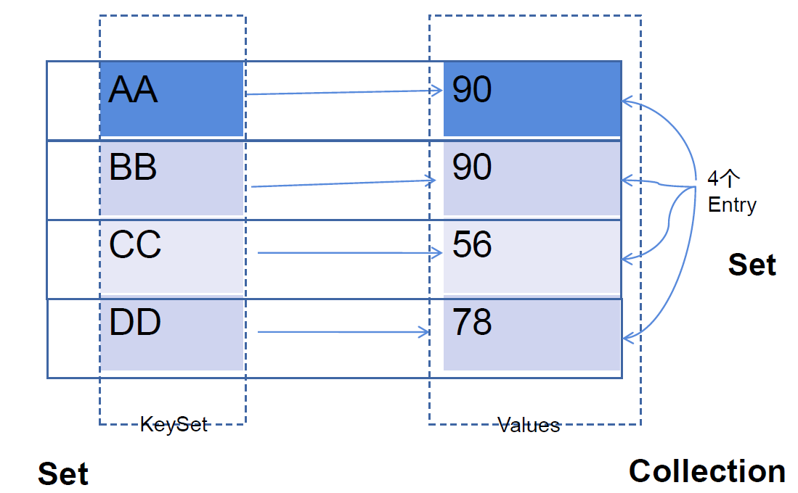


### 3. 常用方法

#### 3.1 添加、删除、修改操作：

- Object put(Object key,Object value)：将指定 key-value 添加到 (或修改) 当前 map 对象中
- void putAll(Map m): 将 m 中的所有 key-value 对存放到当前 map 中
- Object remove(Object key)：移除指定 key 的 key-value 对，并返回 value
- void clear()：清空当前 map 中的所有数据

代码示例：

```java
@Test
public void test1() {
    Map map = new HashMap();
    //Object put(Object key,Object value)：将指定key-value添加到(或修改)当前map对象中
    map.put("AA",123);
    map.put("ZZ",251);
    map.put("CC",110);
    map.put("RR",124);
    map.put("FF",662);
    System.out.println(map);//{AA=123, ZZ=251, CC=110, RR=124, FF=662}

    //Object put(Object key,Object value)：将指定key-value添加到(或修改)当前map对象中
    map.put("ZZ",261);
    System.out.println(map);//{AA=123, ZZ=261, CC=110, RR=124, FF=662}

    //void putAll(Map m):将m中的所有key-value对存放到当前map中
    HashMap map1 = new HashMap();
    map1.put("GG",435);
    map1.put("DD",156);
    map.putAll(map1);
    System.out.println(map);//{AA=123, ZZ=261, CC=110, RR=124, FF=662, GG=435, DD=156}

    //Object remove(Object key)：移除指定key的key-value对，并返回value
    Object value = map.remove("GG");
    System.out.println(value);//435
    System.out.println(map);//{AA=123, ZZ=261, CC=110, RR=124, FF=662, DD=156}

    //void clear()：清空当前map中的所有数据
    map.clear();
    System.out.println(map.size());//0  与map = null操作不同
    System.out.println(map);//{}
}
```

#### 3.2 元素查询的操作：

- Object get(Object key)：获取指定 key 对应的 value
- boolean containsKey(Object key)：是否包含指定的 key
- boolean containsValue(Object value)：是否包含指定的 value
- int size()：返回 map 中 key-value 对的个数
- boolean isEmpty()：判断当前 map 是否为空
- boolean equals(Object obj)：判断当前 map 和参数对象 obj 是否相等

代码示例：

```java
@Test
public void test2() {
    Map map = new HashMap();
    map.put("AA", 123);
    map.put("ZZ", 251);
    map.put("CC", 110);
    map.put("RR", 124);
    map.put("FF", 662);
    System.out.println(map);//{AA=123, ZZ=251, CC=110, RR=124, FF=662}
    //Object get(Object key)：获取指定key对应的value
    System.out.println(map.get("AA"));//123

    //boolean containsKey(Object key)：是否包含指定的key
    System.out.println(map.containsKey("ZZ"));//true

    //boolean containsValue(Object value)：是否包含指定的value
    System.out.println(map.containsValue(123));//true

    //int size()：返回map中key-value对的个数
    System.out.println(map.size());//5

    //boolean isEmpty()：判断当前map是否为空
    System.out.println(map.isEmpty());//false

    //boolean equals(Object obj)：判断当前map和参数对象obj是否相等
    Map map1 = new HashMap();
    map1.put("AA", 123);
    map1.put("ZZ", 251);
    map1.put("CC", 110);
    map1.put("RR", 124);
    map1.put("FF", 662);
    System.out.println(map.equals(map1));//true
}
```

#### 3.3 元视图操作的方法：

- Set keySet()：返回所有 key 构成的 Set 集合
- Collection values()：返回所有 value 构成的 Collection 集合
- Set entrySet()：返回所有 key-value 对构成的 Set 集合

代码示例：

```java
@Test
public void test3() {
    Map map = new HashMap();
    map.put("AA", 123);
    map.put("ZZ", 251);
    map.put("CC", 110);
    map.put("RR", 124);
    map.put("FF", 662);
    System.out.println(map);//{AA=123, ZZ=251, CC=110, RR=124, FF=662}
    //遍历所有的key集:Set keySet()：返回所有key构成的Set集合
    Set set = map.keySet();
    Iterator iterator = set.iterator();
    while (iterator.hasNext()) {
        System.out.println(iterator.next());
    }
    System.out.println("--------------");
    //遍历所有的value集：Collection values()：返回所有value构成的Collection集合
    Collection values = map.values();
    for (Object obj :
         values) {
        System.out.println(obj);
    }
    System.out.println("---------------");
    //Set entrySet()：返回所有key-value对构成的Set集合
    Set entrySet = map.entrySet();
    Iterator iterator1 = entrySet.iterator();
    //方式一：
    while (iterator1.hasNext()) {
        Object obj = iterator1.next();
        //entrySet集合中的元素都是entry
        Map.Entry entry = (Map.Entry) obj;
        System.out.println(entry.getKey() + "-->" + entry.getValue());
    }
    System.out.println("--------------");

    //方式二：
    Set keySet = map.keySet();
    Iterator iterator2 = keySet.iterator();
    while (iterator2.hasNext()) {
        Object key = iterator2.next();
        Object value = map.get(key);
        System.out.println(key + "==" + value);
    }
}
```

#### 总结：常用方法：

- 添加：put(Object key,Object value)
- 删除：remove(Object key)
- 修改：put(Object key,Object value)
- 查询：get(Object key)
- 长度：size()
- 遍历：keySet() / values() / entrySet()

### 4. 内存结构说明：（难点）

#### 4.1 HashMap 在 JDK 7.0 中实现原理：

4.1.1 HashMap 的存储结构：

JDK 7.0 及以前的版本：HashMap 是数组 + 链表结构（地址链表法）

JDK 8.0 版本以后：HashMap 是数组 + 链表 + 红黑树实现


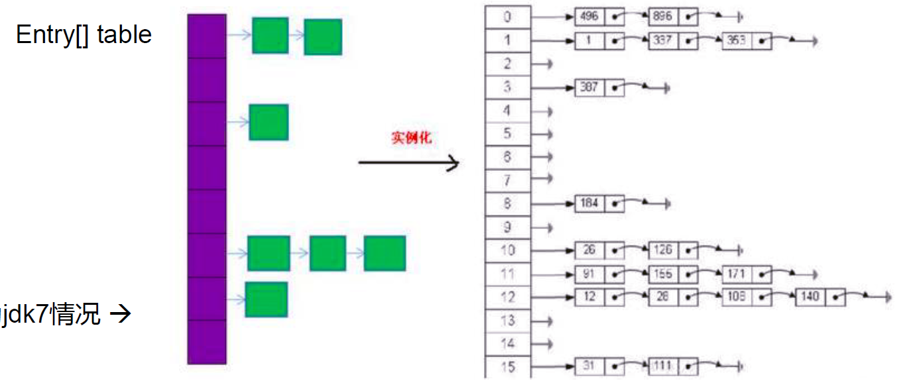


4.1.2 对象创建和添加过程：

HashMap map = new HashMap():

在实例化以后，底层创建了长度是 16 的一维数组 Entry[] table。

 ... 可能已经执行过多次 put...

map.put(key1,value1):

- 首先，调用 key1 所在类的 hashCode() 计算 key1 哈希值，此哈希值经过某种算法计算以后，得到在 Entry 数组中的存放位置。
- 如果此位置上的数据为空，此时的 key1-value1 添加成功。 ---- 情况 1
- 如果此位置上的数据不为空，(意味着此位置上存在一个或多个数据 (以链表形式存在)), 比较 key1 和已经存在的一个或多个数据的哈希值：
  - 如果 key1 的哈希值与已经存在的数据的哈希值都不相同，此时 key1-value1 添加成功。---- 情况 2
  - 如果 key1 的哈希值和已经存在的某一个数据 (key2-value2) 的哈希值相同，继续比较：调用 key1 所在类的 equals(key2)方法，比较：
    - 如果 equals() 返回 false: 此时 key1-value1 添加成功。---- 情况 3
    - 如果 equals() 返回 true: 使用 value1 替换 value2。

补充：关于情况 2 和情况 3：此时 key1-value1 和原来的数据以链表的方式存储。

在不断的添加过程中，会涉及到扩容问题，当超出临界值 (且要存放的位置非空) 时，扩容。默认的扩容方式：扩容为原来容量的 2 倍，并将原有的数据复制过来。

4.1.3 HashMap 的扩容

当 HashMap 中的元素越来越多的时候，hash 冲突的几率也就越来越高，因为数组的长度是固定的。所以为了提高查询的效率，就要对 HashMap 的数组进行扩容，而在 HashMap 数组扩容之后，原数组中的数据必须重新计算其在新数组中的位置，并放进去，这就是 resize。

4.1.4 HashMap 扩容时机

当 HashMap 中的元素个数超过数组大小（数组总大小 length，不是数组中个数）* loadFactor 时，就会进行数组扩容，loadFactor 的默认值 (DEFAULT_LOAD_ FACTOR) 为 0.75，这是一个折中的取值。也就是说，默认情况下，数组大小 (DEFAULT INITIAL CAPACITY) 为 16，那么当 HashMap 中元素个数超过 16 * 0.75=12（这个值就是代码中的 threshold 值，也叫做临界值）的时候，就把数组的大小扩展为 2 * 16=32，即扩大一倍，然后重新计算每个元素在数组中的位置，而这是一个非常消耗性能的操作，所以如果我们已经预知 HashMap 中元素的个数，那么预设元素的个数能够有效的提高 HashMap 的性能。

#### 4.2 HashMap 在 JDK 8.0 底层实现原理：

4.2.1 HashMap 的存储结构：

HashMap 的内部存储结构其实是数组 + 链表 + 红黑树的组合。


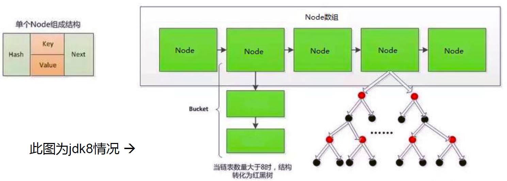


4.2.2 HashMap 添加元素的过程：

当实例化一个 HashMap 时，会初始化 initialCapacity 和 loadFactor，在 put 第一对映射关系时，系统会创建一个长度为 initialCapacity 的 Node 数组，这个长度在哈希表中被称为容量（Capacity），在这个数组中可以存放元素的位置我们称之为 “桶”（ bucket），每个 bucket 都有自己的索引，系统可以根据索引快速的查找 bucket 中的元素。

每个 bucket 中存储一个元素，即一个 Node 对象，但每一个 Noe 对象可以带个引用变量 next，用于指向下一个元素，因此，在一个桶中，就有可能生成一个 Node 链。也可能是一个一个 TreeNode 对象，每一个 Tree node 对象可以有两个叶子结点 left 和 right，因此，在一个桶中，就有可能生成一个 TreeNode 树。而新添加的元素作为链表的 last，或树的叶子结点。

4.2.3 HashMap 的扩容机制:

- 当 HashMapl 中的其中一个链的对象个数没有达到 8 个和 JDK 7.0 以前的扩容方式一样。
- 当 HashMapl 中的其中一个链的对象个数如果达到了 8 个，此时如果 capacity 没有达到 64，那么 HashMap 会先扩容解决，如果已经达到了 64，那么这个链会变成树，结点类型由 Node 变成 Tree Node 类型。当然，如果当映射关系被移除后，下次 resize 方法时判断树的结点个数低于 6 个，也会把树再转为链表。

4.2.4 JDK 8.0 与 JDK 7.0 中 HashMap 底层的变化：

1. new HashMap(): 底层没有创建一个长度为 16 的数组
2. JDK 8.0 底层的数组是：Node[], 而非 Entry[]
3. 首次调用 put() 方法时，底层创建长度为 16 的数组
4. JDK 7.0 底层结构只有：数组 + 链表。JDK 8.0 中底层结构：数组 + 链表 + 红黑树。
   - 形成链表时，七上八下（jdk7: 新的元素指向旧的元素。jdk8：旧的元素指向新的元素）
   - 当数组的某一个索引位置上的元素以链表形式存在的数据个数 > 8 且当前数组的长度 > 64 时，此时此索引位置上的所数据改为使用红黑树存储。

#### 4.3 HashMap 底层典型属性的属性的说明：

- DEFAULT_INITIAL_CAPACITY : HashMap 的默认容量，16
- DEFAULT_LOAD_FACTOR：HashMap 的默认加载因子：0.75
- threshold：扩容的临界值，= 容量 * 填充因子：16 * 0.75 => 12
- TREEIFY_THRESHOLD：Bucket 中链表长度大于该默认值，转化为红黑树: JDK 8.0 引入
- MIN_TREEIFY_CAPACITY：桶中的 Node 被树化时最小的 hash 表容量: 64

#### 4.4 LinkedHashMap 的底层实现原理

- LinkedHashMap 底层使用的结构与 HashMap 相同，因为 LinkedHashMap 继承于 HashMap.
- 区别就在于：LinkedHashMap 内部提供了 Entry，替换 HashMap 中的 Node.
- 与 Linkedhash Set 类似，LinkedHashMap 可以维护 Map 的迭代顺序：迭代顺序与 Key-value 对的插入顺序一致

HashMap 中内部类 Node 源码：

```java
static class Node<K,V> implements Map.Entry<K,V>{
    final int hash;
    final K key;
    V value;
    Node<K,V> next;
}
```

LinkedHashM 中内部类 Entry 源码：

```java
static class Entry<K,V> extends HashMap.Node<K,V> {
    Entry<K,V> before, after;//能够记录添加的元素的先后顺序
    Entry(int hash, K key, V value, Node<K,V> next) {
        super(hash, key, value, next);
    }
}
```

### 5. TreeMap 的使用

向 TreeMap 中添加 key-value，要求 key 必须是由同一个类创建的对象 要照 key 进行排序：自然排序 、定制排序

代码示例：

```java
//自然排序
@Test
public void test() {
    TreeMap map = new TreeMap();
    User u1 = new User("Tom", 23);
    User u2 = new User("Jarry", 18);
    User u3 = new User("Bruce", 56);
    User u4 = new User("Davie", 23);

    map.put(u1, 98);
    map.put(u2, 16);
    map.put(u3, 92);
    map.put(u4, 100);

    Set entrySet = map.entrySet();
    Iterator iterator = entrySet.iterator();
    while (iterator.hasNext()) {
        Object obj = iterator.next();
        Map.Entry entry = (Map.Entry) obj;
        System.out.println(entry.getKey() + "=" + entry.getValue());
    }
}

//定制排序：按照年龄大小排
@Test
public void test2() {
    TreeMap map = new TreeMap(new Comparator() {
        @Override
        public int compare(Object o1, Object o2) {
            if (o1 instanceof User && o2 instanceof User) {
                User u1 = (User) o1;
                User u2 = (User) o2;
                return Integer.compare(u1.getAge(), u2.getAge());
            }
            throw new RuntimeException("输入数据类型错误");
        }
    });
    User u1 = new User("Tom", 23);
    User u2 = new User("Jarry", 18);
    User u3 = new User("Bruce", 56);
    User u4 = new User("Davie", 23);

    map.put(u1, 98);
    map.put(u2, 16);
    map.put(u3, 92);
    map.put(u4, 100);

    Set entrySet = map.entrySet();
    Iterator iterator = entrySet.iterator();
    while (iterator.hasNext()) {
        Object obj = iterator.next();
        Map.Entry entry = (Map.Entry) obj;
        System.out.println(entry.getKey() + "=" + entry.getValue());
    }
}
```

### 6. 使用 Properties 读取配置文件

代码示例：

```java
//Properties:常用来处理配置文件。key和value都是String类型
public static void main(String[] args)  {
    FileInputStream fis = null;
    try {
        Properties pros = new Properties();

        fis = new FileInputStream("jdbc.properties");
        pros.load(fis);//加载流对应的文件

        String name = pros.getProperty("name");
        String password = pros.getProperty("password");

        System.out.println("name = " + name + ", password = " + password);
    } catch (IOException e) {
        e.printStackTrace();
    } finally {
        if(fis != null){
            try {
                fis.close();
            } catch (IOException e) {
                e.printStackTrace();
            }

        }
    }

}
```

### 7. 面试题

1. HashMap 的底层实现原理？
2. HashMap 和 Hashtable 的异同？
3. CurrentHashMap 与 Hashtable 的异同？
4. 负载因子值的大小，对 HashMap 的影响？
   - 负载因子的大小决定了 HashMap 的数据密度。
   - 负载因子越大密度越大，发生碰撞的几率越高，数组中的链表越容易长，造成査询或插入时的比较次数增多，性能会下降
   - 负载因子越小，就越容易触发扩容，数据密度也越小，意味着发生碰撞的几率越小，数组中的链表也就越短，查询和插入时比较的次数也越小，性能会更高。但是会浪费一定的内容空间。而且经常扩容也会影响性能，建议初始化预设大一点的空间
   - 按照其他语言的参考及研究经验，会考虑将负载因子设置为 0.7~0.75，此时平均检索长度接近于常数。

## 七、Collection 工具类的使用

### 1. 作用：

Collections 是一个操作 Set、Lit 和 Map 等集合的工具类

Collections 中提供了一系列静态的方法对集合元素进行排序、査询和修改等操作，还提供了对集合对象设置不可变、对集合对象实现同步控制等方法

### 2. 常用方法：

#### 2.1 排序操作

- reverse(List)：反转 List 中元素的顺序
- shuffle(List)：对 List 集合元素进行随机排序
- sort(List)：根据元素的自然顺序对指定 List 集合元素升序排序
- sort(List，Comparator)：根据指定的 Comparator 产生的顺序对 List 集合元素进行排序
- swap(List，int， int)：将指定 list 集合中的 i 处元素和 j 处元素进行交换

代码示例：

```java
@Test
public void test1() {
    List list = new ArrayList();
    list.add(123);
    list.add(43);
    list.add(765);
    list.add(-97);
    list.add(0);
    System.out.println(list);//[123, 43, 765, -97, 0]

    //reverse(List)：反转 List 中元素的顺序
    Collections.reverse(list);
    System.out.println(list);//[0, -97, 765, 43, 123]

    //shuffle(List)：对 List 集合元素进行随机排序
    Collections.shuffle(list);
    System.out.println(list);//[765, -97, 123, 0, 43]

    //sort(List)：根据元素的自然顺序对指定 List 集合元素按升序排序
    Collections.sort(list);
    System.out.println(list);//[-97, 0, 43, 123, 765]

    //swap(List，int， int)：将指定 list 集合中的 i 处元素和 j 处元素进行交换
    Collections.swap(list,1,4);
    System.out.println(list);//[-97, 765, 43, 123, 0]
}
```

#### 2.2 查找、替换

- Object max(Collection)：根据元素的自然顺序，返回给定集合中的最大元素
- Object max(Collection，Comparator)：根据 Comparator 指定的顺序，返回给定集合中的最大元素
- Object min(Collection)
- Object min(Collection，Comparator)
- int frequency(Collection，Object)：返回指定集合中指定元素的出现次数
- void copy(List dest,List src)：将 src 中的内容复制到 dest 中
- boolean replaceAll(List list，Object oldVal，Object newVal)：使用新值替换 List 对象的所旧值

代码示例：

```java
@Test
public void test2(){
    List list = new ArrayList();
    list.add(123);
    list.add(123);
    list.add(123);
    list.add(43);
    list.add(765);
    list.add(-97);
    list.add(0);
    System.out.println(list);//[123, 43, 765, -97, 0]
    //Object max(Collection)：根据元素的自然顺序，返回给定集合中的最大元素
    Comparable max = Collections.max(list);
    System.out.println(max);//765

    //Object min(Collection)
    Comparable min = Collections.min(list);
    System.out.println(min);//-97

    //int frequency(Collection，Object)：返回指定集合中指定元素的出现次数
    int frequency = Collections.frequency(list,123);
    System.out.println(frequency);//3

    //void copy(List dest,List src)：将src中的内容复制到dest中
    List dest = Arrays.asList(new Object[list.size()]);
    System.out.println(dest.size());//7
    Collections.copy(dest,list);
    System.out.println(dest);//[123, 123, 123, 43, 765, -97, 0]
    //boolean replaceAll(List list，Object oldVal，Object newVal)：使用新值替换 List 对象的所有旧值
}
```

#### 2.3 同步控制

Collections 类中提供了多个 synchronizedXxx() 方法，该方法可使将指定集合包装成线程同步的集合，从而可以解决多线程并发访问集合时的线程安全问题


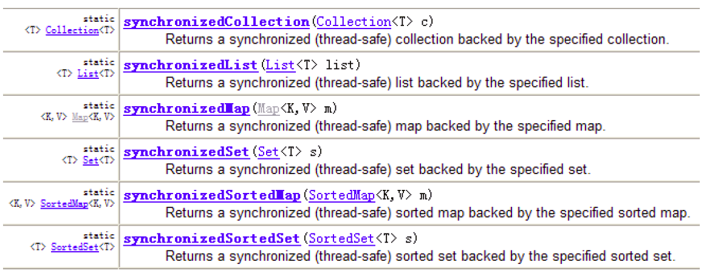


代码示例：

```java
@Test
public void test3() {
    List list = new ArrayList();
    list.add(123);
    list.add(123);
    list.add(123);
    list.add(43);
    list.add(765);
    list.add(-97);
    list.add(0);
    System.out.println(list);//[123, 43, 765, -97, 0]
    //返回的list1即为线程安全的List
    List list1 = Collections.synchronizedList(list);
    System.out.println(list1);//[123, 123, 123, 43, 765, -97, 0]
}
```

## 八、数据结构简述

计划后续专门开一个系列来聊一下数据结构的那些事

### 1. 数据结构概述

数据结构（Data Structure 是一门和计算机硬件与软件都密切相关的学科，它的研究重点是在计算机的程序设计领域中探讨如何在计算机中组织和存储数据并进行高效率的运用，涉及的内容包含：数据的逻辑关系、数据的存储结构、排序算法（Algorithm）、查找（或搜索）等。

### 2. 数据结构与算法的理解

程序能否快速而高效地完成预定的任务，取决于是否选对了数据结构，而程序是否能清楚而正确地把问题解决，则取决于算法。

所以大家认为：“Algorithms + Data Structures = Programs”（出自：Pascal 之父 Nicklaus Wirth）

总结：算法是为了解决实际问题而设计的，数据结构是算法需要处理的问题载体。

### 3. 数据结构的研究对象

#### 3.1 数据间的逻辑结构

集合结构


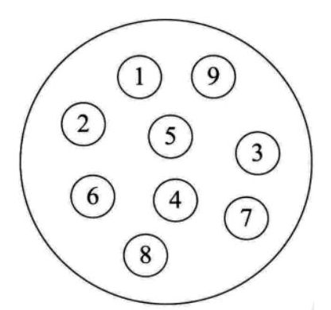


一对一：线性结构


一对多：树形结构


多对多：图形结构


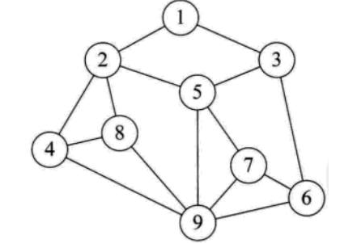


#### 3.2 数据的存储结构：

线性表（顺序表、链表、栈、队列） 树 图

说明： 习惯上把顺序表和链表看做基本数据结构（或真实数据结构） 习惯上把栈、队列、树、图看做抽象数据类型，简称 ADT

### 4. 思维导图：

思维导图下载地址： [点我下载](./src/数据结构-Java版.xmind)

#### 数据结构与算法：


全文完

